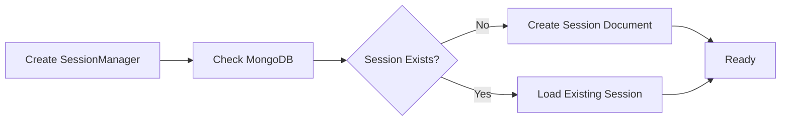
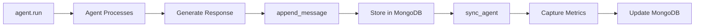

# Basic Concepts

Understanding the core concepts of MongoDB Session Manager will help you use it effectively. This guide explains the fundamental building blocks and how they work together.

## Overview

MongoDB Session Manager provides persistent storage for Strands Agent conversations. At its core, it manages three key concepts:

1. **Sessions** - Containers for conversations
2. **Agents** - AI assistants that participate in conversations
3. **Messages** - Individual exchanges in the conversation

## Core Concepts

### Sessions

A **session** represents a complete conversation context. Think of it as a chat window or conversation thread.

```python
# Each session has a unique identifier
session_id = "user-alice-support-2024-01-15"
```

**Key characteristics:**
- **Unique ID**: Each session must have a unique `session_id`
- **Persistent**: Sessions are stored in MongoDB and survive restarts
- **Multiple Agents**: One session can contain multiple agents
- **Metadata**: Sessions can store custom metadata
- **Lifecycle**: Created on first use, persists until explicitly deleted

**Use cases:**
- User support conversations
- Multi-turn dialogues
- Stateful AI interactions
- Long-running workflows

### Agents

An **agent** is an AI assistant that participates in a session. Multiple agents can exist in the same session with separate conversation histories.

```python
agent = Agent(
    model="claude-3-sonnet",
    agent_id="support-agent",  # Unique within session
    session_manager=session_manager
)
```

**Key characteristics:**
- **Agent ID**: Each agent has a unique `agent_id` within a session
- **Separate History**: Each agent maintains its own message history
- **State Persistence**: Agent state is automatically saved
- **Model Configuration**: Each agent can use different models

**Use cases:**
- Specialized agents (translator, support, analyst)
- Multi-agent workflows
- Role-based interactions
- A/B testing different models

### Messages

**Messages** are the individual exchanges between users and agents. They form the conversation history.

```python
# User message
{"role": "user", "content": "Hello!"}

# Assistant message
{"role": "assistant", "content": "Hi! How can I help?"}
```

**Key characteristics:**
- **Auto-incrementing IDs**: Each message gets a unique `message_id`
- **Timestamps**: Automatic `created_at` and `updated_at` timestamps
- **Metrics**: Assistant messages include token counts and latency
- **Immutable**: Messages are append-only (except for redaction)

### Session Manager

The **MongoDBSessionManager** is the main interface for managing sessions. It handles all interactions with MongoDB.

```python
from mongodb_session_manager import MongoDBSessionManager

session_manager = MongoDBSessionManager(
    session_id="conversation-001",
    connection_string="mongodb://localhost:27017/",
    database_name="my_app",
    collection_name="sessions"
)
```

**Responsibilities:**
- Create and manage sessions
- Store and retrieve messages
- Persist agent state
- Capture metrics automatically
- Manage metadata and feedback

## Data Flow

### 1. Creating a Session



```python
# First time: Creates new session in MongoDB
session_manager = MongoDBSessionManager(
    session_id="new-session-001",
    connection_string="mongodb://localhost:27017/",
    database_name="mydb"
)
```

### 2. Adding Messages



```python
# User message
session_manager.append_message(
    {"role": "user", "content": "Hello"},
    agent
)

# Agent processes and responds
response = agent("Hello")

# Assistant message with metrics
session_manager.append_message(
    {"role": "assistant", "content": response},
    agent
)

# Capture event loop metrics
session_manager.sync_agent(agent)
```

### 3. Resuming a Session

```python
# Later, same session_id loads previous conversation
session_manager = MongoDBSessionManager(
    session_id="new-session-001",  # Same ID!
    connection_string="mongodb://localhost:27017/",
    database_name="mydb"
)

# Same agent_id restores conversation history
agent = Agent(
    agent_id="assistant",  # Same ID!
    session_manager=session_manager
)

# Agent has access to previous messages
```

## Connection Management

### Owned vs Borrowed Connections

MongoDB Session Manager supports two connection patterns:

#### Owned Connection (Simple)

```python
# Manager creates and owns the MongoDB client
session_manager = MongoDBSessionManager(
    session_id="session-001",
    connection_string="mongodb://localhost:27017/",
    database_name="mydb"
)

# Manager will close the connection when done
session_manager.close()
```

#### Borrowed Connection (Advanced)

```python
from pymongo import MongoClient

# Create MongoDB client externally
client = MongoClient("mongodb://localhost:27017/")

# Pass client to session manager
session_manager = MongoDBSessionManager(
    session_id="session-001",
    client=client,  # Borrowed connection
    database_name="mydb"
)

# Manager won't close borrowed connection
session_manager.close()  # Client remains open

# You manage the connection lifecycle
client.close()
```

**When to use borrowed connections:**
- Connection pooling with factory pattern
- Shared connection across multiple managers
- Custom MongoDB client configuration
- Testing with mock clients

## Persistence Mechanics

### Automatic Persistence

The session manager automatically persists:

```python
agent = Agent(
    model="claude-3-sonnet",
    session_manager=session_manager
)

# This automatically stores the message in MongoDB
response = agent("Tell me about MongoDB")

# This captures metrics and updates MongoDB
session_manager.sync_agent(agent)
```

**What gets stored:**
- User and assistant messages
- Message timestamps
- Agent state
- Event loop metrics (tokens, latency)
- Metadata
- Feedback

### Manual Persistence

You can also manually manage persistence:

```python
# Explicitly append messages
session_manager.append_message(
    {"role": "user", "content": "Hello"},
    agent
)

# Explicitly sync agent state
session_manager.sync_agent(agent)

# Update metadata
session_manager.update_metadata({"status": "active"})

# Add feedback
session_manager.add_feedback({
    "rating": "up",
    "comment": "Helpful!"
})
```

## MongoDB Document Structure

### Session Document

Each session is stored as a MongoDB document:

```json
{
  "_id": "session-001",
  "session_id": "session-001",
  "session_type": "default",
  "created_at": ISODate("2024-01-15T10:00:00Z"),
  "updated_at": ISODate("2024-01-15T10:05:00Z"),
  "metadata": {
    "user_id": "alice",
    "topic": "support"
  },
  "agents": {
    "agent-001": {
      "agent_data": {...},
      "messages": [...]
    }
  },
  "feedbacks": [...]
}
```

### Nested Structure

- **Session** (root document)
  - `_id` / `session_id`: Unique identifier
  - `created_at` / `updated_at`: Timestamps
  - `metadata`: Custom key-value pairs
  - `agents`: Object containing all agents
    - **Agent** (nested object)
      - `agent_data`: Agent configuration and state
      - `messages`: Array of messages
        - **Message** (array element)
          - `message_id`: Auto-increment ID
          - `role`: "user" or "assistant"
          - `content`: Message text
          - `event_loop_metrics`: Token counts and latency
          - `created_at` / `updated_at`: Timestamps
  - `feedbacks`: Array of feedback objects

## Metrics and Event Loop

### Automatic Metrics Capture

The session manager captures metrics from the agent's event loop:

```python
# Use the agent
response = agent("Hello")

# Sync captures these metrics from agent.event_loop_metrics
session_manager.sync_agent(agent)

# Metrics stored in MongoDB:
# - latencyMs: Response time
# - inputTokens: Tokens in prompt
# - outputTokens: Tokens in response
# - totalTokens: Sum of input + output
```

### Metrics Location

Metrics are stored in the `event_loop_metrics` field of assistant messages:

```json
{
  "message_id": 2,
  "role": "assistant",
  "content": "Hello! How can I help?",
  "event_loop_metrics": {
    "accumulated_metrics": {
      "latencyMs": 250
    },
    "accumulated_usage": {
      "inputTokens": 10,
      "outputTokens": 15,
      "totalTokens": 25
    }
  }
}
```

## Metadata System

### What is Metadata?

Metadata is custom data you attach to sessions for tracking, filtering, or business logic:

```python
session_manager.update_metadata({
    "user_id": "alice",
    "department": "support",
    "priority": "high",
    "language": "en"
})
```

### Partial Updates

Metadata updates are **partial** - they preserve existing fields:

```python
# Initial metadata
session_manager.update_metadata({
    "user_id": "alice",
    "topic": "billing"
})

# Update only priority (user_id and topic remain)
session_manager.update_metadata({
    "priority": "urgent"
})

# Result: {"user_id": "alice", "topic": "billing", "priority": "urgent"}
```

### Metadata Operations

```python
# Update/create fields
session_manager.update_metadata({"key": "value"})

# Get all metadata
metadata = session_manager.get_metadata()

# Delete specific fields
session_manager.delete_metadata(["sensitive_field"])
```

## Feedback System

### Collecting Feedback

Track user satisfaction with ratings and comments:

```python
# Positive feedback
session_manager.add_feedback({
    "rating": "up",
    "comment": "Very helpful response!"
})

# Negative feedback
session_manager.add_feedback({
    "rating": "down",
    "comment": "The answer was incomplete"
})

# Neutral feedback
session_manager.add_feedback({
    "rating": None,
    "comment": "Just testing"
})
```

### Feedback Storage

Feedback is stored in an array with automatic timestamps:

```json
{
  "feedbacks": [
    {
      "rating": "up",
      "comment": "Very helpful!",
      "created_at": ISODate("2024-01-15T10:30:00Z")
    }
  ]
}
```

## Hook System

### What are Hooks?

Hooks let you intercept and enhance operations:

```python
def audit_hook(original_func, action, session_id, **kwargs):
    """Log all metadata operations."""
    print(f"[AUDIT] {action} on session {session_id}")

    # Call original function
    if action == "update":
        return original_func(kwargs["metadata"])
    elif action == "delete":
        return original_func(kwargs["keys"])
    else:
        return original_func()

# Apply hook
session_manager = MongoDBSessionManager(
    session_id="session-001",
    connection_string="mongodb://localhost:27017/",
    metadata_hook=audit_hook
)
```

### Hook Types

**Metadata Hooks** - Intercept metadata operations:
- `update` - When metadata is updated
- `get` - When metadata is retrieved
- `delete` - When metadata is deleted

**Feedback Hooks** - Intercept feedback operations:
- `add` - When feedback is added

## Connection Pooling

### The Problem

Creating new MongoDB connections is expensive (10-50ms per connection):

```python
# Bad: Creates new connection every time
for request in requests:
    manager = MongoDBSessionManager(
        session_id=request.session_id,
        connection_string="mongodb://localhost:27017/"
    )
    # Handle request...
    manager.close()  # Close connection
```

### The Solution: Connection Pool

Reuse MongoDB connections across requests:

```python
from mongodb_session_manager import MongoDBConnectionPool

# Initialize pool once
pool = MongoDBConnectionPool.initialize(
    connection_string="mongodb://localhost:27017/",
    maxPoolSize=100
)

# Get client from pool (fast!)
client = MongoDBConnectionPool.get_client()

# Use with session managers
for request in requests:
    manager = MongoDBSessionManager(
        session_id=request.session_id,
        client=client,  # Reuse connection
        database_name="mydb"
    )
    # Handle request...
```

**Benefits:**
- **Faster**: No connection overhead
- **Efficient**: Controlled number of connections
- **Scalable**: Handle more concurrent requests

## Factory Pattern

### What is the Factory?

The factory creates session managers with a shared connection pool:

```python
from mongodb_session_manager import MongoDBSessionManagerFactory

# Create factory once
factory = MongoDBSessionManagerFactory(
    connection_string="mongodb://localhost:27017/",
    database_name="mydb",
    maxPoolSize=100
)

# Create managers efficiently (reuses connection)
manager1 = factory.create_session_manager("session-001")
manager2 = factory.create_session_manager("session-002")
manager3 = factory.create_session_manager("session-003")

# All managers share the same connection pool!
```

### Global Factory

For application-wide use (like FastAPI):

```python
from mongodb_session_manager import (
    initialize_global_factory,
    get_global_factory,
    close_global_factory
)

# App startup
factory = initialize_global_factory(
    connection_string="mongodb://localhost:27017/",
    database_name="mydb"
)

# Anywhere in your app
def handle_request(session_id):
    factory = get_global_factory()
    manager = factory.create_session_manager(session_id)
    # Use manager...

# App shutdown
close_global_factory()
```

## Best Practices

### Session ID Patterns

Use consistent, meaningful session IDs:

```python
# User-specific
session_id = f"user-{user_id}-{purpose}"

# Dated sessions
session_id = f"user-{user_id}-{date}"

# Conversation threads
session_id = f"user-{user_id}-thread-{thread_id}"
```

### Agent ID Patterns

Use descriptive agent IDs:

```python
# Role-based
agent_id = "support-agent"

# Specialized
agent_id = "translator-agent"

# Versioned
agent_id = "assistant-v2"
```

### Lifecycle Management

Always close session managers when done:

```python
try:
    session_manager = MongoDBSessionManager(...)
    agent = Agent(session_manager=session_manager)

    # Use agent...

finally:
    session_manager.close()  # Always close!
```

Or use context managers (when available):

```python
# Future: Context manager support
with MongoDBSessionManager(...) as session_manager:
    agent = Agent(session_manager=session_manager)
    # Automatic cleanup
```

### Error Handling

Handle MongoDB errors gracefully:

```python
from pymongo.errors import PyMongoError

try:
    session_manager = MongoDBSessionManager(...)
    response = agent("Hello")
    session_manager.sync_agent(agent)

except PyMongoError as e:
    logger.error(f"MongoDB error: {e}")
    # Fallback behavior

except Exception as e:
    logger.error(f"Unexpected error: {e}")
    # Handle error

finally:
    if session_manager:
        session_manager.close()
```

## Key Takeaways

Understanding these concepts will help you use MongoDB Session Manager effectively:

✓ **Sessions** contain conversations with unique IDs
✓ **Agents** have separate message histories within sessions
✓ **Messages** are automatically persisted with metrics
✓ **Metadata** provides flexible session context
✓ **Hooks** enable custom behavior
✓ **Connection pooling** improves performance
✓ **Factory pattern** optimizes for stateless environments

## Next Steps

Now that you understand the basics:

1. [Explore the User Guide](../user-guide/session-management.md) for detailed feature documentation
2. [Check out Examples](../examples/basic-usage.md) for practical use cases
3. [Review the API Reference](../api-reference/mongodb-session-manager.md) for all available methods
4. [Learn about Architecture](../architecture/overview.md) for deeper understanding
