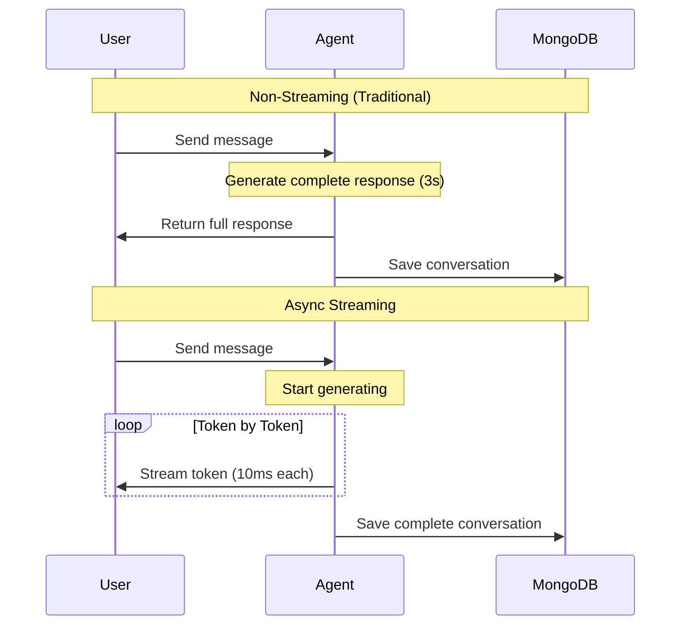

# Async Streaming User Guide

## Overview

The MongoDB Session Manager fully supports async streaming responses from AI agents, allowing you to stream tokens in real-time while persisting complete conversations and capturing metrics. This guide covers streaming patterns, session persistence, and real-time metrics tracking.

## Table of Contents

1. [What is Async Streaming?](#what-is-async-streaming)
2. [Basic Streaming Pattern](#basic-streaming-pattern)
3. [Session Persistence During Streaming](#session-persistence-during-streaming)
4. [Real-Time Metrics Capture](#real-time-metrics-capture)
5. [FastAPI Integration](#fastapi-integration)
6. [Error Handling](#error-handling)
7. [Best Practices](#best-practices)

## What is Async Streaming?

**Async streaming** allows AI agents to return responses token-by-token as they're generated, rather than waiting for the complete response. This provides:

- **Real-time Feedback**: Users see responses as they're generated
- **Better UX**: Perceived faster response times
- **Reduced Latency**: First token arrives much faster
- **Session Persistence**: Full conversation history maintained
- **Automatic Metrics**: Tokens and latency tracked during streaming

### Streaming vs Non-Streaming



## Basic Streaming Pattern

### Simple Streaming Example

```python
import asyncio
from strands import Agent
from mongodb_session_manager import create_mongodb_session_manager

async def stream_response():
    """Stream AI agent response token-by-token."""

    # Create session manager
    session_manager = create_mongodb_session_manager(
        session_id="user-123",
        connection_string="mongodb://localhost:27017/",
        database_name="chat_db"
    )

    # Create agent with session
    agent = Agent(
        agent_id="assistant",
        model="claude-3-sonnet",
        session_manager=session_manager
    )

    # User message
    prompt = "Explain async programming in Python"

    # Append user message
    session_manager.append_message(
        {"role": "user", "content": prompt},
        agent
    )

    # Stream response
    response_chunks = []

    print("Response: ", end="", flush=True)

    async for event in agent.stream_async(prompt):
        if "data" in event:
            chunk = event["data"]
            response_chunks.append(chunk)
            print(chunk, end="", flush=True)  # Real-time output

    print()  # Newline

    # Combine chunks into full response
    full_response = "".join(response_chunks)

    # Append assistant message
    session_manager.append_message(
        {"role": "assistant", "content": full_response},
        agent
    )

    # Sync agent state and metrics
    session_manager.sync_agent(agent)

    # Clean up
    session_manager.close()

# Run
asyncio.run(stream_response())
```

### Stream Events

The `agent.stream_async()` generator yields events:

```python
{
    "type": "content_block_delta",
    "data": "token text",  # Token/chunk of text
    "index": 0
}

# Other event types:
# - content_block_start: Start of response
# - content_block_stop: End of response
# - message_start: Message metadata
# - message_stop: Final metrics
```

### Processing Stream Events

```python
async for event in agent.stream_async(prompt):
    event_type = event.get("type")

    if event_type == "content_block_delta":
        # Token data
        token = event.get("data", "")
        print(token, end="", flush=True)

    elif event_type == "content_block_start":
        # Response started
        print("Assistant: ", end="", flush=True)

    elif event_type == "message_stop":
        # Response completed
        print("\n[Stream complete]")
```

## Session Persistence During Streaming

### Complete Pattern

```python
import asyncio
from strands import Agent
from mongodb_session_manager import create_mongodb_session_manager

async def chat_with_streaming(session_id: str, prompt: str):
    """Chat with streaming and full session persistence."""

    # Create session manager
    session_manager = create_mongodb_session_manager(
        session_id=session_id,
        connection_string="mongodb://localhost:27017/",
        database_name="chat_db"
    )

    # Create agent
    agent = Agent(
        agent_id="assistant",
        model="claude-3-sonnet",
        session_manager=session_manager,
        system_prompt="You are a helpful assistant."
    )

    # Store user message
    session_manager.append_message(
        {"role": "user", "content": prompt},
        agent
    )

    # Stream response
    response_chunks = []

    async for event in agent.stream_async(prompt):
        if "data" in event:
            chunk = event["data"]
            response_chunks.append(chunk)
            # Send to client, websocket, SSE, etc.
            yield chunk

    # Combine full response
    full_response = "".join(response_chunks)

    # Store assistant message
    session_manager.append_message(
        {"role": "assistant", "content": full_response},
        agent
    )

    # Sync metrics
    session_manager.sync_agent(agent)

    # Conversation is now fully persisted!
    session_manager.close()

# Usage
async def main():
    async for chunk in chat_with_streaming("user-123", "Hello!"):
        print(chunk, end="", flush=True)

asyncio.run(main())
```

### Resume Streaming Session

```python
async def resume_and_continue():
    """Resume previous streaming session."""

    # Load existing session
    session_manager = create_mongodb_session_manager(
        session_id="user-123",  # Same session ID
        connection_string="mongodb://localhost:27017/",
        database_name="chat_db"
    )

    # Create agent - automatically loads history
    agent = Agent(
        agent_id="assistant",  # Same agent ID
        model="claude-3-sonnet",
        session_manager=session_manager
    )

    # Agent has full conversation context!
    # Continue streaming
    async for chunk in chat_with_streaming("user-123", "Continue our discussion"):
        print(chunk, end="", flush=True)
```

## Real-Time Metrics Capture

### Automatic Metrics

Metrics are automatically captured when you call `sync_agent()`:

```python
async def stream_with_metrics():
    """Stream response and capture metrics."""

    session_manager = create_mongodb_session_manager(
        session_id="user-123",
        connection_string="mongodb://localhost:27017/",
        database_name="chat_db"
    )

    agent = Agent(
        agent_id="assistant",
        model="claude-3-sonnet",
        session_manager=session_manager
    )

    # User message
    prompt = "Explain quantum computing"
    session_manager.append_message({"role": "user", "content": prompt}, agent)

    # Stream response
    response_chunks = []
    async for event in agent.stream_async(prompt):
        if "data" in event:
            response_chunks.append(event["data"])

    # Save response
    full_response = "".join(response_chunks)
    session_manager.append_message(
        {"role": "assistant", "content": full_response},
        agent
    )

    # Sync captures metrics from agent.event_loop_metrics
    session_manager.sync_agent(agent)

    # Metrics now stored in MongoDB:
    # - latencyMs: Total response time
    # - inputTokens: Tokens in request
    # - outputTokens: Tokens in response
    # - totalTokens: Total tokens used

    session_manager.close()
```

### Accessing Metrics

Metrics are stored with each assistant message:

```python
# Query MongoDB directly
from mongodb_session_manager import MongoDBSessionRepository

repo = MongoDBSessionRepository(
    connection_string="mongodb://localhost:27017/",
    database_name="chat_db",
    collection_name="sessions"
)

# Get session
doc = repo.collection.find_one({"_id": "user-123"})

# Access last message metrics
if doc and "agents" in doc:
    messages = doc["agents"]["assistant"]["messages"]
    last_message = messages[-1]

    if "event_loop_metrics" in last_message:
        metrics = last_message["event_loop_metrics"]
        print(f"Latency: {metrics['accumulated_metrics']['latencyMs']}ms")
        print(f"Input tokens: {metrics['accumulated_usage']['inputTokens']}")
        print(f"Output tokens: {metrics['accumulated_usage']['outputTokens']}")
```

## FastAPI Integration

### Basic Streaming Endpoint

```python
from fastapi import FastAPI
from fastapi.responses import StreamingResponse
from strands import Agent
from mongodb_session_manager import get_global_factory

app = FastAPI()

@app.post("/chat/stream")
async def chat_stream(session_id: str, message: str):
    """Stream chat response with session persistence."""

    async def generate():
        # Get session manager from factory
        factory = get_global_factory()
        session_manager = factory.create_session_manager(session_id)

        # Create agent
        agent = Agent(
            agent_id="assistant",
            model="claude-3-sonnet",
            session_manager=session_manager
        )

        # Store user message
        session_manager.append_message(
            {"role": "user", "content": message},
            agent
        )

        # Stream response
        response_chunks = []

        async for event in agent.stream_async(message):
            if "data" in event:
                chunk = event["data"]
                response_chunks.append(chunk)
                yield chunk  # Stream to client

        # Save complete response
        full_response = "".join(response_chunks)
        session_manager.append_message(
            {"role": "assistant", "content": full_response},
            agent
        )

        # Sync metrics
        session_manager.sync_agent(agent)

    return StreamingResponse(generate(), media_type="text/plain")
```

### Server-Sent Events (SSE)

```python
from fastapi import FastAPI
from fastapi.responses import StreamingResponse
import json

app = FastAPI()

@app.post("/chat/sse")
async def chat_sse(session_id: str, message: str):
    """Stream chat response as Server-Sent Events."""

    async def generate_sse():
        factory = get_global_factory()
        session_manager = factory.create_session_manager(session_id)

        agent = Agent(
            agent_id="assistant",
            model="claude-3-sonnet",
            session_manager=session_manager
        )

        # Store user message
        session_manager.append_message(
            {"role": "user", "content": message},
            agent
        )

        # Stream response
        response_chunks = []

        async for event in agent.stream_async(message):
            if "data" in event:
                chunk = event["data"]
                response_chunks.append(chunk)

                # SSE format
                sse_data = json.dumps({"type": "token", "data": chunk})
                yield f"data: {sse_data}\n\n"

        # Complete response
        full_response = "".join(response_chunks)
        session_manager.append_message(
            {"role": "assistant", "content": full_response},
            agent
        )
        session_manager.sync_agent(agent)

        # Send completion event
        yield f"data: {json.dumps({'type': 'done'})}\n\n"

    return StreamingResponse(
        generate_sse(),
        media_type="text/event-stream",
        headers={
            "Cache-Control": "no-cache",
            "Connection": "keep-alive"
        }
    )
```

### Complete FastAPI Example

From `examples/example_fastapi_streaming.py`:

```python
from fastapi import FastAPI, Request
from fastapi.responses import StreamingResponse
from contextlib import asynccontextmanager
from strands import Agent
from mongodb_session_manager import (
    initialize_global_factory,
    get_global_factory,
    close_global_factory
)

@asynccontextmanager
async def lifespan(app: FastAPI):
    """Initialize factory on startup."""
    initialize_global_factory(
        connection_string="mongodb://localhost:27017/",
        database_name="chat_db",
        maxPoolSize=100
    )
    yield
    close_global_factory()

app = FastAPI(lifespan=lifespan)

@app.post("/chat")
async def chat(request: Request, data: dict, session_id: str):
    """Handle chat with streaming."""

    async def generate():
        # Get session manager
        factory = get_global_factory()
        session_manager = factory.create_session_manager(session_id)

        # Create agent
        agent = Agent(
            agent_id="assistant",
            model="claude-3-sonnet",
            session_manager=session_manager
        )

        # Get prompt
        prompt = data.get("prompt")

        # Stream response
        response_chunks = []

        async for event in agent.stream_async(prompt):
            if "data" in event:
                chunk = event["data"]
                response_chunks.append(chunk)
                yield chunk

        # Note: Saving response happens after stream completes
        # For production, consider background task

    return StreamingResponse(generate(), media_type="text/plain")
```

## Error Handling

### Handle Stream Errors

```python
async def stream_with_error_handling(session_id: str, prompt: str):
    """Stream with comprehensive error handling."""

    session_manager = None
    try:
        # Create session manager
        session_manager = create_mongodb_session_manager(
            session_id=session_id,
            connection_string="mongodb://localhost:27017/",
            database_name="chat_db"
        )

        # Create agent
        agent = Agent(
            agent_id="assistant",
            model="claude-3-sonnet",
            session_manager=session_manager
        )

        # Store user message
        session_manager.append_message(
            {"role": "user", "content": prompt},
            agent
        )

        # Stream response
        response_chunks = []

        try:
            async for event in agent.stream_async(prompt):
                if "data" in event:
                    chunk = event["data"]
                    response_chunks.append(chunk)
                    yield chunk

        except Exception as stream_error:
            # Handle streaming errors
            error_msg = f"\n[Error during streaming: {stream_error}]"
            response_chunks.append(error_msg)
            yield error_msg

        # Save response (even if incomplete)
        full_response = "".join(response_chunks)
        session_manager.append_message(
            {"role": "assistant", "content": full_response},
            agent
        )

        # Sync metrics
        try:
            session_manager.sync_agent(agent)
        except Exception as sync_error:
            logger.error(f"Error syncing agent: {sync_error}")

    except Exception as e:
        logger.error(f"Error in stream_with_error_handling: {e}")
        yield f"\n[Error: {e}]"

    finally:
        if session_manager:
            session_manager.close()
```

### Timeout Handling

```python
import asyncio

async def stream_with_timeout(session_id: str, prompt: str, timeout: int = 30):
    """Stream with timeout."""

    async def stream_response():
        # ... streaming logic
        async for chunk in chat_with_streaming(session_id, prompt):
            yield chunk

    try:
        async for chunk in asyncio.wait_for(stream_response(), timeout=timeout):
            yield chunk
    except asyncio.TimeoutError:
        yield "\n[Response timeout - streaming stopped]"
```

## Best Practices

### 1. Always Save Complete Response

```python
# Good - save full response after streaming
response_chunks = []
async for event in agent.stream_async(prompt):
    if "data" in event:
        chunk = event["data"]
        response_chunks.append(chunk)
        yield chunk

full_response = "".join(response_chunks)
session_manager.append_message({"role": "assistant", "content": full_response}, agent)

# Bad - don't save individual chunks
async for event in agent.stream_async(prompt):
    if "data" in event:
        session_manager.append_message({"role": "assistant", "content": event["data"]}, agent)  # Wrong!
```

### 2. Sync Metrics After Streaming

```python
# Good - sync after stream completes
async for event in agent.stream_async(prompt):
    # ... stream tokens
    pass

session_manager.sync_agent(agent)  # Capture metrics

# Bad - sync during streaming
async for event in agent.stream_async(prompt):
    session_manager.sync_agent(agent)  # Too frequent!
```

### 3. Handle Errors Gracefully

```python
# Good - handle errors, still save partial response
try:
    async for event in agent.stream_async(prompt):
        # ... stream
        pass
except Exception as e:
    logger.error(f"Stream error: {e}")
    response_chunks.append(f"\n[Error: {e}]")

# Always save what we have
full_response = "".join(response_chunks)
session_manager.append_message({"role": "assistant", "content": full_response}, agent)
```

### 4. Use Factory Pattern

```python
# Good - reuse connection pool
factory = get_global_factory()
session_manager = factory.create_session_manager(session_id)

# Bad - new connection per request
session_manager = MongoDBSessionManager(
    session_id=session_id,
    connection_string="..."  # New connection!
)
```

### 5. Buffer Output for Efficiency

```python
# Good - buffer chunks
buffer = []
buffer_size = 10

async for event in agent.stream_async(prompt):
    if "data" in event:
        buffer.append(event["data"])

        if len(buffer) >= buffer_size:
            yield "".join(buffer)
            buffer = []

# Flush remaining
if buffer:
    yield "".join(buffer)

# Bad - send every token immediately (too many network calls)
async for event in agent.stream_async(prompt):
    if "data" in event:
        yield event["data"]  # One network call per token!
```

### 6. Set Appropriate Timeouts

```python
# Good - reasonable timeout
async def stream_with_timeout():
    async with asyncio.timeout(60):  # 60 second timeout
        async for chunk in chat_with_streaming(...):
            yield chunk

# Bad - no timeout
async def stream_no_timeout():
    async for chunk in chat_with_streaming(...):
        yield chunk  # Could hang forever!
```

### 7. Clean Up Resources

```python
# Good - always close
try:
    async for chunk in chat_with_streaming(session_id, prompt):
        yield chunk
finally:
    session_manager.close()

# Alternative - use async context manager pattern
class SessionContext:
    async def __aenter__(self):
        self.manager = create_mongodb_session_manager(...)
        return self.manager

    async def __aexit__(self, *args):
        self.manager.close()
```

## Next Steps

- **[FastAPI Integration](../examples/fastapi-examples.md)**: Complete FastAPI examples
- **[Session Management](session-management.md)**: Understand session lifecycle
- **[Factory Pattern](factory-pattern.md)**: Optimize for production
- **[Performance Tuning](../deployment/performance.md)**: Optimize streaming performance

## Additional Resources

- [Strands SDK Documentation](https://github.com/anthropics/strands)
- [FastAPI Streaming](https://fastapi.tiangolo.com/advanced/custom-response/#streamingresponse)
- [Server-Sent Events](https://developer.mozilla.org/en-US/docs/Web/API/Server-sent_events)
- [Async Python Guide](https://docs.python.org/3/library/asyncio.html)
