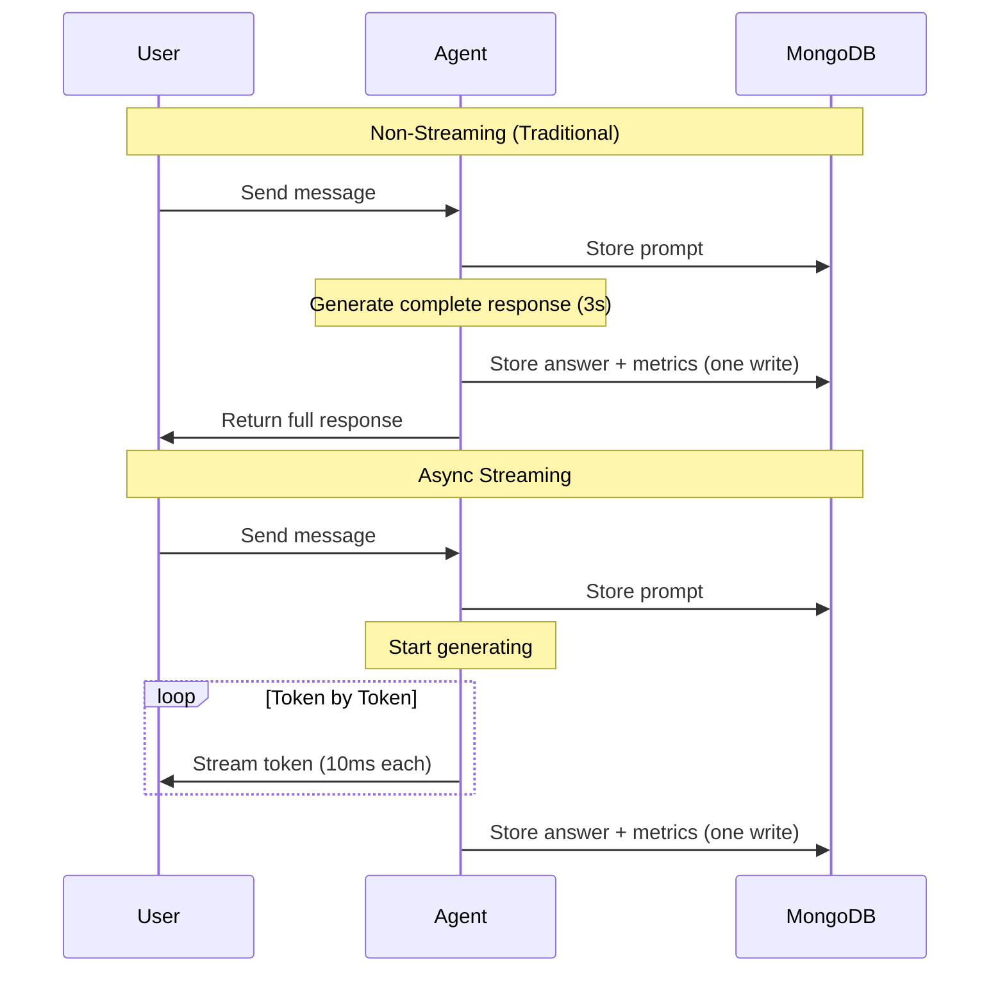

# Async Streaming User Guide

## Overview

The MongoDB Session Manager fully supports async streaming responses from AI agents, allowing you to stream tokens in real-time while persisting complete conversations and capturing metrics. This guide covers streaming patterns, session persistence, and real-time metrics tracking.

## Table of Contents

1. [What is Async Streaming?](#what-is-async-streaming)
2. [Basic Streaming Pattern](#basic-streaming-pattern)
3. [Session Persistence During Streaming](#session-persistence-during-streaming)
4. [Real-Time Metrics Capture](#real-time-metrics-capture)
5. [FastAPI Integration](#fastapi-integration)
6. [Error Handling](#error-handling)
7. [Best Practices](#best-practices)

## What is Async Streaming?

**Async streaming** allows AI agents to return responses token-by-token as they're generated, rather than waiting for the complete response. This provides:

- **Real-time Feedback**: Users see responses as they're generated
- **Better UX**: Perceived faster response times
- **Reduced Latency**: First token arrives much faster
- **Session Persistence**: Full conversation history maintained
- **Automatic Metrics**: Tokens and latency tracked during streaming

### Streaming vs Non-Streaming


```mermaid
sequenceDiagram
    participant User
    participant Agent
    participant MongoDB

    Note over User,MongoDB: Non-Streaming (Traditional)
    User->>Agent: Send message
    Agent->>MongoDB: Store prompt
    Note over Agent: Generate complete response (3s)
    Agent->>MongoDB: Store answer + metrics (one write)
    Agent->>User: Return full response

    Note over User,MongoDB: Async Streaming
    User->>Agent: Send message
    Agent->>MongoDB: Store prompt
    Note over Agent: Start generating
    loop Token by Token
        Agent->>User: Stream token (10ms each)
    end
    Agent->>MongoDB: Store answer + metrics (one write)
```

In both cases the writes are made by the session manager, through the hooks the `Agent` registers: your code only streams.

## Basic Streaming Pattern

### Simple Streaming Example

```python
import asyncio
from strands import Agent
from mongodb_session_manager import create_mongodb_session_manager


async def stream_response():
    """Stream AI agent response token-by-token."""

    # Create session manager
    session_manager = create_mongodb_session_manager(
        session_id="user-123",
        connection_string="mongodb://localhost:27017/",
        database_name="chat_db",
    )

    # Create agent with session
    agent = Agent(
        agent_id="assistant", model="claude-3-sonnet", session_manager=session_manager
    )

    # User message
    prompt = "Explain async programming in Python"

    print("Response: ", end="", flush=True)

    # Stream response. The session manager persists the conversation on its
    # own: the prompt is written as it arrives, and the answer, with the
    # invocation's metrics, in a single write when the stream ends.
    async for event in agent.stream_async(prompt):
        if "data" in event:
            print(event["data"], end="", flush=True)  # Real-time output

    print()  # Newline

    # Clean up
    session_manager.close()


# Run
asyncio.run(stream_response())
```

!!! note "Persistence is automatic"
    An `Agent` built with `session_manager=` hands every message it adds to the manager through the hooks it registers, streamed or not. Do not call `append_message()` yourself for such an agent: the message would be stored twice. Since v0.24.0 the messages the event loop produces in an invocation (tool calls, tool results, the answer) are batched into one write when the invocation closes, with the metrics inside the last one; the user's prompt is written as it arrives ([issue #53](https://github.com/iguinea/mongodb-session-manager/issues/53)). Calling `sync_agent()` afterwards is optional and costs one more write.

### Stream Events

The `agent.stream_async()` generator yields dictionaries. Which keys an event carries tells what it is (see the Strands documentation of `Agent.stream_async` for the full list):

```python
{"data": "token text", ...}  # A chunk of the text being generated

# Other keys you will meet:
# - "current_tool_use": a tool call being streamed
# - "reasoningText": reasoning content, on models that emit it
# - "result": the final AgentResult, in the last event of the stream
```

### Processing Stream Events

```python
async for event in agent.stream_async(prompt):
    if "data" in event:
        # Token data
        print(event["data"], end="", flush=True)

    elif "current_tool_use" in event:
        # The model is calling a tool
        tool_name = event["current_tool_use"].get("name")

    elif "result" in event:
        # Response completed
        print("\n[Stream complete]")
```

## Session Persistence During Streaming

### Complete Pattern

```python
import asyncio
from strands import Agent
from mongodb_session_manager import create_mongodb_session_manager


async def chat_with_streaming(session_id: str, prompt: str):
    """Chat with streaming and full session persistence."""

    # Create session manager
    session_manager = create_mongodb_session_manager(
        session_id=session_id,
        connection_string="mongodb://localhost:27017/",
        database_name="chat_db",
    )

    # Create agent
    agent = Agent(
        agent_id="assistant",
        model="claude-3-sonnet",
        session_manager=session_manager,
        system_prompt="You are a helpful assistant.",
    )

    try:
        # Stream response. The prompt is stored as it arrives; the answer,
        # with the invocation's metrics, when the stream ends.
        async for event in agent.stream_async(prompt):
            if "data" in event:
                # Send to client, websocket, SSE, etc.
                yield event["data"]

        # Conversation is now fully persisted!
    finally:
        session_manager.close()


# Usage
async def main():
    async for chunk in chat_with_streaming("user-123", "Hello!"):
        print(chunk, end="", flush=True)


asyncio.run(main())
```

### Resume Streaming Session

```python
async def resume_and_continue():
    """Resume previous streaming session."""

    # Same session_id, and chat_with_streaming() uses the same agent_id:
    # creating the agent there loads the history before the first token.
    async for chunk in chat_with_streaming("user-123", "Continue our discussion"):
        print(chunk, end="", flush=True)
```

## Real-Time Metrics Capture

### Automatic Metrics

Metrics are captured automatically when the invocation ends, streamed or not, and stored on its last message, inside the same write that stores the messages of the invocation. Calling `sync_agent()` afterwards is optional: it costs one more write, which stores them again with the current values.

```python
async def stream_with_metrics():
    """Stream response and capture metrics."""

    session_manager = create_mongodb_session_manager(
        session_id="user-123",
        connection_string="mongodb://localhost:27017/",
        database_name="chat_db",
    )

    agent = Agent(
        agent_id="assistant", model="claude-3-sonnet", session_manager=session_manager
    )

    # Stream response
    prompt = "Explain quantum computing"
    async for event in agent.stream_async(prompt):
        if "data" in event:
            print(event["data"], end="", flush=True)

    # When the stream ends, the last message of the invocation is already
    # stored with event_loop_metrics, taken from agent.event_loop_metrics:
    # - accumulated_metrics: latencyMs, timeToFirstByteMs
    # - accumulated_usage: inputTokens, outputTokens, totalTokens, cache tokens
    # - cycle_metrics and tool_usage

    session_manager.close()
```

### Accessing Metrics

Two kinds of metrics are stored, and not on the same messages:

- **`event_loop_metrics`**, the invocation's totals, only on the **last message of each invocation**. Intermediate messages (tool calls, tool results) carry none.
- **`message.metadata`**, written by Strands itself (1.56 and later) on **each `assistant` message**, with the `usage` and `metrics` of that model call alone. See [`message.metadata`](../architecture/data-model.md#metadata-optional).

```python
# Query MongoDB directly
from mongodb_session_manager import MongoDBSessionRepository

repo = MongoDBSessionRepository(
    connection_string="mongodb://localhost:27017/",
    database_name="chat_db",
    collection_name="sessions",
)

# Get session
doc = repo.collection.find_one({"_id": "user-123"})

# Access last message metrics
if doc and "agents" in doc:
    messages = doc["agents"]["assistant"]["messages"]
    last_message = messages[-1]

    if "event_loop_metrics" in last_message:
        metrics = last_message["event_loop_metrics"]
        print(f"Latency: {metrics['accumulated_metrics']['latencyMs']}ms")
        print(f"Input tokens: {metrics['accumulated_usage']['inputTokens']}")
        print(f"Output tokens: {metrics['accumulated_usage']['outputTokens']}")

    # Per-call usage of each assistant message
    for stored in messages:
        usage = stored["message"].get("metadata", {}).get("usage")
        if usage:
            print(f"Message {stored['message_id']}: {usage['totalTokens']} tokens")
```

## FastAPI Integration

### Basic Streaming Endpoint

```python
from fastapi import FastAPI
from fastapi.responses import StreamingResponse
from strands import Agent
from mongodb_session_manager import get_global_factory

app = FastAPI()


@app.post("/chat/stream")
async def chat_stream(session_id: str, message: str):
    """Stream chat response with session persistence."""

    async def generate():
        # Get session manager from factory
        factory = get_global_factory()
        session_manager = factory.create_session_manager(session_id)

        # Create agent
        agent = Agent(
            agent_id="assistant",
            model="claude-3-sonnet",
            session_manager=session_manager,
        )

        # Stream response. The agent persists the prompt, the answer and
        # the metrics through the session manager: nothing to save by hand.
        async for event in agent.stream_async(message):
            if "data" in event:
                yield event["data"]  # Stream to client

    return StreamingResponse(generate(), media_type="text/plain")
```

### Server-Sent Events (SSE)

```python
from fastapi import FastAPI
from fastapi.responses import StreamingResponse
import json

app = FastAPI()


@app.post("/chat/sse")
async def chat_sse(session_id: str, message: str):
    """Stream chat response as Server-Sent Events."""

    async def generate_sse():
        factory = get_global_factory()
        session_manager = factory.create_session_manager(session_id)

        agent = Agent(
            agent_id="assistant",
            model="claude-3-sonnet",
            session_manager=session_manager,
        )

        # Stream response (persisted by the agent's session manager)
        async for event in agent.stream_async(message):
            if "data" in event:
                # SSE format
                sse_data = json.dumps({"type": "token", "data": event["data"]})
                yield f"data: {sse_data}\n\n"

        # Send completion event
        yield f"data: {json.dumps({'type': 'done'})}\n\n"

    return StreamingResponse(
        generate_sse(),
        media_type="text/event-stream",
        headers={"Cache-Control": "no-cache", "Connection": "keep-alive"},
    )
```

### Complete FastAPI Example

From `examples/example_fastapi_streaming.py`:

```python
from fastapi import FastAPI, Request
from fastapi.responses import StreamingResponse
from contextlib import asynccontextmanager
from strands import Agent
from mongodb_session_manager import (
    initialize_global_factory,
    get_global_factory,
    close_global_factory,
)


@asynccontextmanager
async def lifespan(app: FastAPI):
    """Initialize factory on startup."""
    initialize_global_factory(
        connection_string="mongodb://localhost:27017/",
        database_name="chat_db",
        maxPoolSize=100,
    )
    yield
    close_global_factory()


app = FastAPI(lifespan=lifespan)


@app.post("/chat")
async def chat(request: Request, data: dict, session_id: str):
    """Handle chat with streaming."""

    async def generate():
        # Get session manager
        factory = get_global_factory()
        session_manager = factory.create_session_manager(session_id)

        # Create agent
        agent = Agent(
            agent_id="assistant",
            model="claude-3-sonnet",
            session_manager=session_manager,
        )

        # Get prompt
        prompt = data.get("prompt")

        # Stream response. The session manager stores the answer, with its
        # metrics, in the write that closes the invocation.
        async for event in agent.stream_async(prompt):
            if "data" in event:
                yield event["data"]

    return StreamingResponse(generate(), media_type="text/plain")
```

## Error Handling

### Handle Stream Errors

```python
async def stream_with_error_handling(session_id: str, prompt: str):
    """Stream with comprehensive error handling."""

    session_manager = None
    try:
        # Create session manager
        session_manager = create_mongodb_session_manager(
            session_id=session_id,
            connection_string="mongodb://localhost:27017/",
            database_name="chat_db",
        )

        # Create agent
        agent = Agent(
            agent_id="assistant",
            model="claude-3-sonnet",
            session_manager=session_manager,
        )

        # Stream response
        async for event in agent.stream_async(prompt):
            if "data" in event:
                yield event["data"]

    except Exception as e:
        # Nothing to save by hand here. The prompt was stored when it
        # arrived, and what the agent had added before the failure is written
        # when the invocation closes, which it does even when it raises. An
        # answer cut off mid-stream was never added to the agent, so it is
        # not part of the conversation: storing it yourself would put in the
        # history a message the agent never had.
        logger.error(f"Error in stream_with_error_handling: {e}")
        yield f"\n[Error: {e}]"

    finally:
        if session_manager:
            # Also writes a batch whose invocation never closed
            session_manager.close()
```

### Timeout Handling

```python
import asyncio


async def stream_with_timeout(session_id: str, prompt: str, timeout: int = 30):
    """Stream with timeout."""

    try:
        async with asyncio.timeout(timeout):  # Python 3.11+
            async for chunk in chat_with_streaming(session_id, prompt):
                yield chunk
    except TimeoutError:
        yield "\n[Response timeout - streaming stopped]"
```

## Best Practices

### 1. Let the Session Manager Persist the Conversation

```python
# Good - just stream: the agent hands each message to the session manager
async for event in agent.stream_async(prompt):
    if "data" in event:
        yield event["data"]

# Bad - append by hand what the agent already persists
full_response = "".join(chunks)
session_manager.append_message(
    {"role": "assistant", "content": [{"text": full_response}]}, agent
)  # Wrong! Stored twice

# Worse - one message per chunk
async for event in agent.stream_async(prompt):
    if "data" in event:
        session_manager.append_message(
            {"role": "assistant", "content": [{"text": event["data"]}]}, agent
        )  # Wrong!
```

### 2. No Need to Sync After Streaming

```python
# Good - the write that closes the invocation already stored the metrics
async for event in agent.stream_async(prompt):
    # ... stream tokens
    pass

# Optional - one more write, which stores the metrics again
session_manager.sync_agent(agent)

# Bad - sync during streaming
async for event in agent.stream_async(prompt):
    session_manager.sync_agent(agent)  # Extra writes, and it flushes the batch early
```

### 3. Handle Errors Gracefully

```python
# Good - handle errors; what the agent added is persisted anyway
try:
    async for event in agent.stream_async(prompt):
        # ... stream
        pass
except Exception as e:
    logger.error(f"Stream error: {e}")
    yield f"\n[Error: {e}]"

# Bad - store the half-streamed answer by hand: the agent never added it,
# so the stored history would no longer match the conversation
```

### 4. Use Factory Pattern

```python
# Good - reuse connection pool
factory = get_global_factory()
session_manager = factory.create_session_manager(session_id)

# Bad - new connection per request
session_manager = MongoDBSessionManager(
    session_id=session_id,
    connection_string="...",  # New connection!
)
```

### 5. Buffer Output for Efficiency

```python
# Good - buffer chunks
buffer = []
buffer_size = 10

async for event in agent.stream_async(prompt):
    if "data" in event:
        buffer.append(event["data"])

        if len(buffer) >= buffer_size:
            yield "".join(buffer)
            buffer = []

# Flush remaining
if buffer:
    yield "".join(buffer)

# Bad - send every token immediately (too many network calls)
async for event in agent.stream_async(prompt):
    if "data" in event:
        yield event["data"]  # One network call per token!
```

### 6. Set Appropriate Timeouts

```python
# Good - reasonable timeout
async def stream_with_timeout():
    async with asyncio.timeout(60):  # 60 second timeout
        async for chunk in chat_with_streaming(...):
            yield chunk


# Bad - no timeout
async def stream_no_timeout():
    async for chunk in chat_with_streaming(...):
        yield chunk  # Could hang forever!
```

### 7. Clean Up Resources

```python
# Good - always close
try:
    async for chunk in chat_with_streaming(session_id, prompt):
        yield chunk
finally:
    session_manager.close()


# Alternative - use async context manager pattern
class SessionContext:
    async def __aenter__(self):
        self.manager = create_mongodb_session_manager(...)
        return self.manager

    async def __aexit__(self, *args):
        self.manager.close()
```

## Next Steps

- **[FastAPI Integration](../examples/fastapi-integration.md)**: Complete FastAPI examples
- **[Session Management](session-management.md)**: Understand session lifecycle
- **[Factory Pattern](factory-pattern.md)**: Optimize for production
- **[Performance](../architecture/performance.md)**: Writes per turn and how to measure them

## Additional Resources

- [Strands Agents Documentation](https://strandsagents.com)
- [FastAPI Streaming](https://fastapi.tiangolo.com/advanced/custom-response/#streamingresponse)
- [Server-Sent Events](https://developer.mozilla.org/en-US/docs/Web/API/Server-sent_events)
- [Async Python Guide](https://docs.python.org/3/library/asyncio.html)
