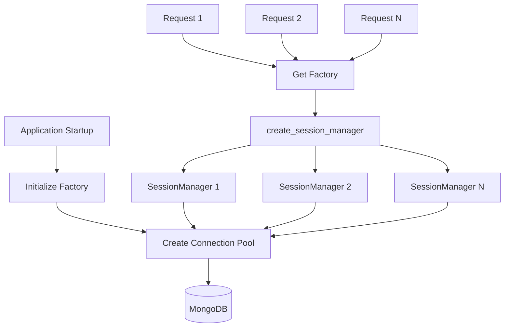
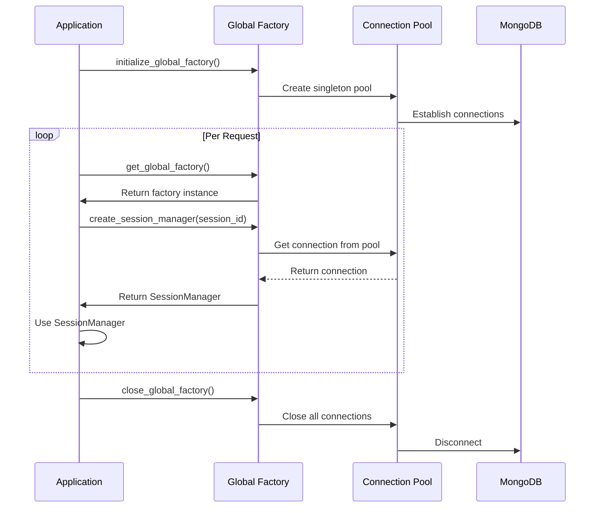
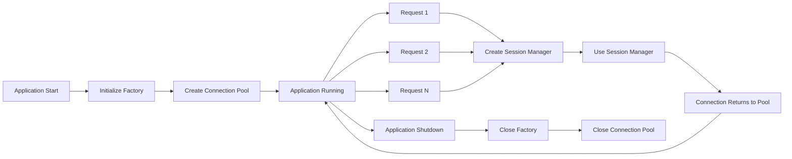

# Factory Pattern User Guide

## Overview

The Factory Pattern provides an efficient way to create MongoDB session managers by reusing a shared connection pool. This is essential for stateless environments like FastAPI where creating new connections for each request would be prohibitively expensive.

## Table of Contents

1. [What is the Factory Pattern?](#what-is-the-factory-pattern)
2. [The Problem It Solves](#the-problem-it-solves)
3. [MongoDBSessionManagerFactory](#mongodbsessionmanagerfactory)
4. [Global Factory Pattern](#global-factory-pattern)
5. [FastAPI Integration](#fastapi-integration)
6. [Per-Request Session Managers](#per-request-session-managers)
7. [Lifecycle Management](#lifecycle-management)
8. [Performance Optimization](#performance-optimization)
9. [Advanced Patterns](#advanced-patterns)
10. [Best Practices](#best-practices)

## What is the Factory Pattern?

The **Factory Pattern** is a creational design pattern that provides an interface for creating objects (session managers) without exposing the creation logic. In this library, it manages a **shared MongoDB connection pool** and creates session managers that reuse connections.

### Architecture Overview



### Key Benefits

- **Connection Reuse**: All session managers share the same connection pool
- **No Overhead**: Creating session managers is virtually instant
- **Resource Efficient**: Controlled connection usage
- **Stateless-Friendly**: Perfect for FastAPI, Flask, Lambda functions
- **Clean API**: Simple interface for common use cases

## The Problem It Solves

### Without Factory Pattern

```python
# Anti-pattern: New connection per request
@app.post("/chat")
async def chat(session_id: str, message: str):
    # Creates NEW MongoDB connection
    session_manager = MongoDBSessionManager(
        session_id=session_id,
        connection_string="mongodb://localhost:27017/",  # New connection!
        database_name="chat_db"
    )

    agent = Agent(session_manager=session_manager, ...)
    response = agent(message)

    session_manager.close()  # Closes connection
    return {"response": response}

# Problems:
# - 10-50ms connection overhead per request
# - Connection pool created and destroyed each time
# - High memory usage
# - Poor scalability
```

### With Factory Pattern

```python
# Startup: Initialize factory ONCE
factory = initialize_global_factory(
    connection_string="mongodb://localhost:27017/",
    database_name="chat_db",
    maxPoolSize=100
)

# Per request: Reuse connection from pool
@app.post("/chat")
async def chat(session_id: str, message: str):
    # Reuses connection from pool - NO overhead!
    session_manager = factory.create_session_manager(session_id)

    agent = Agent(session_manager=session_manager, ...)
    response = agent(message)

    # Don't close - connection is returned to pool automatically
    return {"response": response}

# Benefits:
# - 0ms connection overhead
# - Shared connection pool
# - Low memory usage
# - Excellent scalability
```

### Performance Comparison

```
Benchmark: 100 requests

Without Factory:
- Total time: 6.5 seconds
- Avg per request: 65ms
- Connection overhead: 45ms per request
- Memory: ~500MB
- MongoDB connections: 100

With Factory:
- Total time: 2.0 seconds
- Avg per request: 20ms
- Connection overhead: 0ms
- Memory: ~100MB
- MongoDB connections: 10-20

Result: 3.2x faster, 80% less memory!
```

## MongoDBSessionManagerFactory

The `MongoDBSessionManagerFactory` class manages session manager creation with connection pooling.

### Class Overview

```python
from mongodb_session_manager import MongoDBSessionManagerFactory

class MongoDBSessionManagerFactory:
    """Factory for creating session managers with shared connection pool."""

    def __init__(
        self,
        connection_string: str,
        database_name: str = "database_name",
        collection_name: str = "collection_name",
        client: MongoClient = None,
        metadata_fields: List[str] = None,
        **client_kwargs
    ):
        """Initialize factory with connection pool."""
        pass

    def create_session_manager(
        self,
        session_id: str,
        database_name: str = None,
        collection_name: str = None,
        metadata_fields: List[str] = None,
        **kwargs
    ) -> MongoDBSessionManager:
        """Create session manager using shared connection."""
        pass

    def get_connection_stats(self) -> dict:
        """Get connection pool statistics."""
        pass

    def close(self) -> None:
        """Close factory and connection pool."""
        pass
```

### Creating a Factory

```python
from mongodb_session_manager import MongoDBSessionManagerFactory

# Create factory with connection string
factory = MongoDBSessionManagerFactory(
    connection_string="mongodb://localhost:27017/",
    database_name="my_database",
    collection_name="sessions",
    # Connection pool settings
    maxPoolSize=100,
    minPoolSize=10
)

# Create session managers
manager1 = factory.create_session_manager(session_id="user-123")
manager2 = factory.create_session_manager(session_id="user-456")

# Both share the same connection pool!
```

### Using External Client

```python
from pymongo import MongoClient
from mongodb_session_manager import MongoDBSessionManagerFactory

# Create your own MongoDB client
client = MongoClient(
    "mongodb://localhost:27017/",
    maxPoolSize=200,
    minPoolSize=50
)

# Pass it to the factory
factory = MongoDBSessionManagerFactory(
    client=client,  # Use external client
    database_name="my_database",
    collection_name="sessions"
)

# Create session managers that use your client
manager = factory.create_session_manager(session_id="user-123")
```

## Global Factory Pattern

For convenience, the library provides global factory functions for application-wide usage.

### Global Factory Functions

```python
from mongodb_session_manager import (
    initialize_global_factory,
    get_global_factory,
    close_global_factory
)

# Initialize once at startup
factory = initialize_global_factory(
    connection_string="mongodb://localhost:27017/",
    database_name="chat_db",
    collection_name="sessions",
    maxPoolSize=100
)

# Access anywhere in your application
factory = get_global_factory()
manager = factory.create_session_manager(session_id="user-123")

# Close during shutdown
close_global_factory()
```

### Global Factory Lifecycle



## FastAPI Integration

The factory pattern is ideal for FastAPI applications using the lifespan pattern.

### Complete FastAPI Example

```python
from fastapi import FastAPI, Request
from fastapi.responses import JSONResponse
from contextlib import asynccontextmanager
from mongodb_session_manager import (
    initialize_global_factory,
    get_global_factory,
    close_global_factory
)
from strands import Agent

@asynccontextmanager
async def lifespan(app: FastAPI):
    """Handle application startup and shutdown."""
    # Startup: Initialize factory ONCE
    factory = initialize_global_factory(
        connection_string="mongodb://localhost:27017/",
        database_name="chat_db",
        collection_name="sessions",
        # Optimized for production
        maxPoolSize=100,
        minPoolSize=10,
        maxIdleTimeMS=30000
    )

    # Store in app state (optional but recommended)
    app.state.session_factory = factory

    print("Application started - factory initialized")

    yield

    # Shutdown: Clean up
    close_global_factory()
    print("Application stopped - factory closed")

# Create FastAPI app
app = FastAPI(lifespan=lifespan)

@app.post("/chat")
async def chat(request: Request, data: dict):
    """Handle chat request with session persistence."""
    session_id = data.get("session_id")
    message = data.get("message")

    # Method 1: Get from app state (recommended - explicit)
    factory = request.app.state.session_factory

    # Method 2: Get global factory (alternative - simpler)
    # factory = get_global_factory()

    # Create session manager (reuses connection - NO overhead!)
    session_manager = factory.create_session_manager(session_id)

    # Create agent
    agent = Agent(
        agent_id="chatbot",
        model="claude-3-sonnet",
        session_manager=session_manager
    )

    # Process message
    response = agent(message)

    # Sync agent state and metrics
    session_manager.sync_agent(agent)

    # Return response (connection returned to pool automatically)
    return JSONResponse({"response": response})

@app.get("/health")
async def health():
    """Health check endpoint."""
    try:
        factory = get_global_factory()
        stats = factory.get_connection_stats()
        return {"status": "healthy", "mongodb": stats}
    except Exception as e:
        return {"status": "unhealthy", "error": str(e)}

@app.get("/metrics")
async def metrics():
    """Get connection pool metrics."""
    factory = get_global_factory()
    stats = factory.get_connection_stats()
    return {"connection_pool": stats}
```

### Startup/Shutdown Hooks

```python
from fastapi import FastAPI
from mongodb_session_manager import (
    initialize_global_factory,
    close_global_factory
)

app = FastAPI()

@app.on_event("startup")
async def startup():
    """Initialize factory on startup."""
    initialize_global_factory(
        connection_string="mongodb://localhost:27017/",
        database_name="chat_db",
        maxPoolSize=100
    )
    print("Factory initialized")

@app.on_event("shutdown")
async def shutdown():
    """Close factory on shutdown."""
    close_global_factory()
    print("Factory closed")
```

## Per-Request Session Managers

### Creating Session Managers

```python
from mongodb_session_manager import get_global_factory

# Get factory
factory = get_global_factory()

# Create session manager for this request
session_manager = factory.create_session_manager(
    session_id="user-123"
)

# Use it
agent = Agent(session_manager=session_manager, ...)
response = agent("Hello")
session_manager.sync_agent(agent)

# No need to close - connection returned to pool automatically
```

### Override Database/Collection

```python
# Use different database
session_manager = factory.create_session_manager(
    session_id="admin-session",
    database_name="admin_db",  # Override default
    collection_name="admin_sessions"  # Override default
)
```

### Override Metadata Fields

```python
# Use different metadata fields
session_manager = factory.create_session_manager(
    session_id="special-session",
    metadata_fields=["priority", "category", "tags"]  # Override default
)
```

### With Hooks

```python
from mongodb_session_manager import get_global_factory

def audit_metadata(original_func, action, session_id, **kwargs):
    """Audit all metadata operations."""
    print(f"[AUDIT] {action} on {session_id}")
    if action == "update":
        return original_func(kwargs["metadata"])
    elif action == "delete":
        return original_func(kwargs["keys"])
    else:
        return original_func()

# Create session manager with hook
factory = get_global_factory()
session_manager = factory.create_session_manager(
    session_id="user-123",
    metadata_hook=audit_metadata  # Add hook
)
```

## Lifecycle Management

### Application Lifecycle



### Factory Lifecycle

```python
from mongodb_session_manager import MongoDBSessionManagerFactory

# 1. Create factory (startup)
factory = MongoDBSessionManagerFactory(
    connection_string="mongodb://localhost:27017/",
    database_name="chat_db",
    maxPoolSize=100
)

# 2. Use factory (per request)
for i in range(1000):
    session_manager = factory.create_session_manager(f"session-{i}")
    # Use session_manager...
    # Connection automatically returned to pool

# 3. Close factory (shutdown)
factory.close()
```

### Session Manager Lifecycle

```python
# Create session manager
session_manager = factory.create_session_manager(session_id="user-123")

# Use session manager
agent = Agent(session_manager=session_manager, ...)
response = agent("Hello")
session_manager.sync_agent(agent)

# No need to close!
# Connection is returned to pool when session_manager goes out of scope
# OR you can explicitly not worry about it
```

## Performance Optimization

### Optimal Factory Settings

```python
from mongodb_session_manager import initialize_global_factory

# For high-traffic applications
factory = initialize_global_factory(
    connection_string="mongodb://localhost:27017/",
    database_name="chat_db",
    # Large pool for many concurrent requests
    maxPoolSize=200,
    minPoolSize=50,
    # Fast timeouts for responsiveness
    waitQueueTimeoutMS=3000,
    serverSelectionTimeoutMS=3000,
    # Network optimization
    compressors=["snappy", "zlib"],
    # Retry for reliability
    retryWrites=True,
    retryReads=True
)
```

### Monitoring Performance

```python
import time
from mongodb_session_manager import get_global_factory

# Measure session manager creation time
factory = get_global_factory()

start = time.time()
for i in range(1000):
    session_manager = factory.create_session_manager(f"session-{i}")
end = time.time()

print(f"Created 1000 session managers in {end - start:.2f}s")
# Output: Created 1000 session managers in 0.05s
# That's 0.05ms per session manager!
```

### Connection Stats Monitoring

```python
from mongodb_session_manager import get_global_factory
import json

factory = get_global_factory()

# Get detailed stats
stats = factory.get_connection_stats()

print(json.dumps(stats, indent=2))
# Output:
# {
#   "status": "connected",
#   "connection_string": "mongodb://localhost:27017/",
#   "server_version": "7.0.4",
#   "pool_config": {
#     "maxPoolSize": 100,
#     "minPoolSize": 10
#   }
# }
```

### Benchmarking

```python
import asyncio
import time
from mongodb_session_manager import initialize_global_factory

# Initialize factory
initialize_global_factory(
    connection_string="mongodb://localhost:27017/",
    database_name="benchmark_db",
    maxPoolSize=100
)

async def benchmark_request(session_id: str):
    """Simulate a request."""
    factory = get_global_factory()
    session_manager = factory.create_session_manager(session_id)
    # Simulate work...
    await asyncio.sleep(0.1)
    return "done"

async def run_benchmark(num_requests: int):
    """Run benchmark with concurrent requests."""
    start = time.time()
    tasks = [benchmark_request(f"session-{i}") for i in range(num_requests)]
    await asyncio.gather(*tasks)
    end = time.time()

    print(f"Processed {num_requests} requests in {end - start:.2f}s")
    print(f"Throughput: {num_requests / (end - start):.2f} req/s")

# Run benchmark
asyncio.run(run_benchmark(1000))
# Output:
# Processed 1000 requests in 10.05s
# Throughput: 99.5 req/s
```

## Advanced Patterns

### Multi-Tenant Applications

```python
from mongodb_session_manager import MongoDBSessionManagerFactory

# Create factory for each tenant
factories = {}

for tenant_id in ["tenant-1", "tenant-2", "tenant-3"]:
    factories[tenant_id] = MongoDBSessionManagerFactory(
        connection_string="mongodb://localhost:27017/",
        database_name=f"tenant_{tenant_id}",  # Separate DB per tenant
        collection_name="sessions",
        maxPoolSize=50  # Smaller pool per tenant
    )

# Per request
def handle_request(tenant_id: str, session_id: str):
    factory = factories[tenant_id]
    session_manager = factory.create_session_manager(session_id)
    # Process request...
```

### Environment-Specific Factories

```python
import os
from mongodb_session_manager import initialize_global_factory

# Configure based on environment
env = os.getenv("ENV", "development")

if env == "production":
    factory = initialize_global_factory(
        connection_string=os.getenv("MONGO_URI"),
        database_name="production_db",
        maxPoolSize=200,
        minPoolSize=50,
        w="majority",
        journal=True
    )
elif env == "staging":
    factory = initialize_global_factory(
        connection_string=os.getenv("MONGO_URI"),
        database_name="staging_db",
        maxPoolSize=50,
        minPoolSize=10
    )
else:  # development
    factory = initialize_global_factory(
        connection_string="mongodb://localhost:27017/",
        database_name="dev_db",
        maxPoolSize=10,
        minPoolSize=2
    )
```

### Lazy Initialization

```python
from mongodb_session_manager import MongoDBSessionManagerFactory
from typing import Optional

class SessionManagerService:
    """Service with lazy factory initialization."""

    _factory: Optional[MongoDBSessionManagerFactory] = None

    @classmethod
    def get_factory(cls) -> MongoDBSessionManagerFactory:
        """Get or create factory."""
        if cls._factory is None:
            cls._factory = MongoDBSessionManagerFactory(
                connection_string="mongodb://localhost:27017/",
                database_name="chat_db",
                maxPoolSize=100
            )
        return cls._factory

    @classmethod
    def create_session_manager(cls, session_id: str):
        """Create session manager."""
        factory = cls.get_factory()
        return factory.create_session_manager(session_id)

    @classmethod
    def close(cls):
        """Close factory."""
        if cls._factory:
            cls._factory.close()
            cls._factory = None

# Usage
manager = SessionManagerService.create_session_manager("user-123")
# ... use manager
SessionManagerService.close()
```

### Dependency Injection

```python
from fastapi import Depends, FastAPI
from mongodb_session_manager import MongoDBSessionManagerFactory

app = FastAPI()

# Factory dependency
def get_factory() -> MongoDBSessionManagerFactory:
    """Get the session manager factory."""
    return app.state.session_factory

@app.post("/chat")
async def chat(
    session_id: str,
    message: str,
    factory: MongoDBSessionManagerFactory = Depends(get_factory)
):
    """Handle chat with dependency injection."""
    session_manager = factory.create_session_manager(session_id)
    # Process request...
    return {"response": "..."}
```

## Best Practices

### 1. Initialize Once

```python
# DO: Initialize during application startup
@app.on_event("startup")
async def startup():
    initialize_global_factory(...)

# DON'T: Initialize per request
@app.post("/chat")
async def chat(...):
    factory = MongoDBSessionManagerFactory(...)  # Wrong!
```

### 2. Use Global Factory

```python
# DO: Use global factory for simplicity
factory = get_global_factory()
manager = factory.create_session_manager(session_id)

# DON'T: Create multiple factories
factory1 = MongoDBSessionManagerFactory(...)
factory2 = MongoDBSessionManagerFactory(...)  # Creates duplicate pools!
```

### 3. Don't Close Session Managers

```python
# DO: Let connections return to pool automatically
session_manager = factory.create_session_manager(session_id)
# Use session_manager...
# Done - connection returns to pool

# DON'T: Close session managers created by factory
session_manager = factory.create_session_manager(session_id)
session_manager.close()  # Don't do this!
```

### 4. Close Factory on Shutdown

```python
# DO: Close factory during shutdown
@app.on_event("shutdown")
async def shutdown():
    close_global_factory()

# DON'T: Leave factory running
# Missing shutdown handler - connections leak!
```

### 5. Monitor Connection Pool

```python
# DO: Monitor pool health
@app.get("/health")
async def health():
    factory = get_global_factory()
    stats = factory.get_connection_stats()
    return {"mongodb": stats}

# DON'T: Ignore pool health
# No monitoring - can't detect issues!
```

### 6. Size Pool Appropriately

```python
# DO: Match pool size to workload
# High traffic: maxPoolSize=200
# Medium traffic: maxPoolSize=50
# Low traffic: maxPoolSize=10

# DON'T: Use default for everything
# Same settings for all environments!
```

### 7. Handle Errors Gracefully

```python
# DO: Handle factory errors
try:
    factory = get_global_factory()
    manager = factory.create_session_manager(session_id)
except RuntimeError:
    # Factory not initialized
    return {"error": "Service unavailable"}

# DON'T: Let errors crash the app
factory = get_global_factory()  # May raise RuntimeError!
```

## Next Steps

- **[Connection Pooling](connection-pooling.md)**: Deep dive into connection pool configuration
- **[Session Management](session-management.md)**: Learn about session lifecycle
- **[FastAPI Examples](../examples/fastapi-examples.md)**: Complete FastAPI integration examples
- **[Performance Tuning](../deployment/performance.md)**: Optimize for production

## Additional Resources

- [Factory Pattern Documentation](https://refactoring.guru/design-patterns/factory-method)
- [FastAPI Lifespan Events](https://fastapi.tiangolo.com/advanced/events/)
- [MongoDB Connection Pooling](https://pymongo.readthedocs.io/en/stable/api/pymongo/mongo_client.html)
