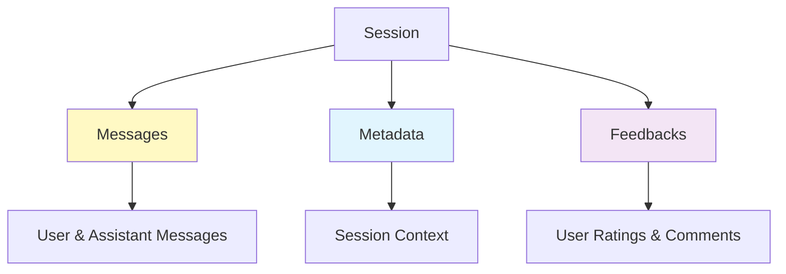

# Feedback System User Guide

## Overview

The Feedback System allows you to collect and store user feedback (ratings and comments) for agent interactions. This guide covers feedback operations, hooks for customization, and integration patterns.

## Table of Contents

1. [What is Feedback?](#what-is-feedback)
2. [Feedback Operations](#feedback-operations)
3. [Feedback Structure](#feedback-structure)
4. [Feedback Hooks](#feedback-hooks)
5. [Use Cases](#use-cases)
6. [FastAPI Integration](#fastapi-integration)
7. [Best Practices](#best-practices)

## What is Feedback?

**Feedback** is user-provided evaluation of agent responses, consisting of:

- **Rating**: Thumbs up ("up"), thumbs down ("down"), or neutral (None)
- **Comment**: Optional text explanation
- **Timestamp**: Automatically added when feedback is stored

### Feedback vs Messages vs Metadata



### MongoDB Schema

```json
{
    "_id": "session-id",
    "session_id": "session-id",
    "feedbacks": [
        {
            "rating": "up",
            "comment": "Very helpful response!",
            "created_at": "2024-01-22T15:00:00Z"
        },
        {
            "rating": "down",
            "comment": "The answer was incomplete",
            "created_at": "2024-01-22T16:30:00Z"
        }
    ]
}
```

## Feedback Operations

### Adding Feedback

```python
from mongodb_session_manager import create_mongodb_session_manager

session_manager = create_mongodb_session_manager(
    session_id="user-123",
    connection_string="mongodb://localhost:27017/",
    database_name="chat_db"
)

# Positive feedback
session_manager.add_feedback({
    "rating": "up",
    "comment": "The response was very helpful!"
})

# Negative feedback
session_manager.add_feedback({
    "rating": "down",
    "comment": "The answer was incomplete"
})

# Neutral feedback (no rating)
session_manager.add_feedback({
    "rating": None,
    "comment": "Just saving this for later"
})

# Minimal feedback (rating only)
session_manager.add_feedback({
    "rating": "up",
    "comment": ""
})
```

### Getting Feedback

```python
# Get all feedbacks for a session
feedbacks = session_manager.get_feedbacks()

print(f"Total feedbacks: {len(feedbacks)}")

for feedback in feedbacks:
    print(f"Rating: {feedback['rating']}")
    print(f"Comment: {feedback['comment']}")
    print(f"Created: {feedback['created_at']}")
    print("---")
```

## Feedback Structure

### Feedback Object

```python
{
    "rating": "up",                       # "up", "down", or None
    "comment": "Great response!",         # Optional text
    "created_at": "2024-01-22T15:00:00Z"  # Auto-added timestamp
}
```

### Rating Values

| Value | Meaning | Use Case |
|-------|---------|----------|
| `"up"` | Positive/Thumbs Up | Good responses |
| `"down"` | Negative/Thumbs Down | Poor responses |
| `None` | Neutral/No Rating | Comments without evaluation |

### Example with All Fields

```python
session_manager.add_feedback({
    "rating": "up",
    "comment": "The code example was perfect and solved my problem immediately!"
})

# Stored as:
# {
#     "rating": "up",
#     "comment": "The code example was perfect...",
#     "created_at": ISODate("2024-01-22T15:00:00Z")  # Auto-added
# }
```

## Feedback Hooks

Hooks allow you to intercept and customize feedback operations.

### Hook Interface

```python
def feedback_hook(original_func, action, session_id, **kwargs):
    """
    Intercept feedback operations.

    Args:
        original_func: The original add_feedback method
        action: Always "add" for feedback
        session_id: Session identifier
        **kwargs: Contains "feedback" key with feedback object
    """
    # Your custom logic here

    # Call original function
    return original_func(kwargs["feedback"])
```

### Example 1: Audit Hook

Log all feedback for compliance:

```python
import logging
import json

logger = logging.getLogger(__name__)

def feedback_audit_hook(original_func, action, session_id, **kwargs):
    """Log all feedback operations."""
    feedback = kwargs["feedback"]

    logger.info(f"[FEEDBACK AUDIT] Session: {session_id}")
    logger.info(f"[FEEDBACK AUDIT] Rating: {feedback.get('rating')}")
    logger.info(f"[FEEDBACK AUDIT] Comment: {feedback.get('comment')}")

    # Store feedback
    result = original_func(feedback)

    logger.info(f"[FEEDBACK AUDIT] Saved successfully")
    return result

# Use the hook
from mongodb_session_manager import MongoDBSessionManager

session_manager = MongoDBSessionManager(
    session_id="user-123",
    connection_string="mongodb://localhost:27017/",
    database_name="my_db",
    feedbackHook=feedback_audit_hook  # All feedback logged
)

session_manager.add_feedback({
    "rating": "up",
    "comment": "Great!"
})
# Output:
# [FEEDBACK AUDIT] Session: user-123
# [FEEDBACK AUDIT] Rating: up
# [FEEDBACK AUDIT] Comment: Great!
# [FEEDBACK AUDIT] Saved successfully
```

### Example 2: Validation Hook

Ensure data quality:

```python
def feedback_validation_hook(original_func, action, session_id, **kwargs):
    """Validate feedback before saving."""
    feedback = kwargs["feedback"]

    # Validate rating
    valid_ratings = ["up", "down", None]
    if feedback.get("rating") not in valid_ratings:
        raise ValueError(f"Invalid rating: {feedback.get('rating')}")

    # Require comment for negative feedback
    if feedback.get("rating") == "down" and not feedback.get("comment", "").strip():
        raise ValueError("Please provide a comment with negative feedback")

    # Limit comment length
    comment = feedback.get("comment", "")
    if len(comment) > 1000:
        raise ValueError(f"Comment too long: {len(comment)} chars (max: 1000)")

    # Sanitize comment
    feedback["comment"] = comment.strip()

    # Add validation timestamp
    from datetime import datetime
    feedback["_validated_at"] = datetime.now().isoformat()

    return original_func(feedback)

# Use the hook
session_manager = MongoDBSessionManager(
    session_id="user-123",
    connection_string="mongodb://localhost:27017/",
    database_name="my_db",
    feedbackHook=feedback_validation_hook
)

# This will pass
session_manager.add_feedback({
    "rating": "down",
    "comment": "The response was incomplete"
})

# This will fail
try:
    session_manager.add_feedback({
        "rating": "down",
        "comment": ""  # Empty comment with negative rating
    })
except ValueError as e:
    print(f"Validation error: {e}")
```

### Example 3: Notification Hook

Alert support team on negative feedback:

```python
class FeedbackNotificationHook:
    """Send alerts for negative feedback."""

    def __init__(self):
        self.negative_count = {}

    def __call__(self, original_func, action, session_id, **kwargs):
        feedback = kwargs["feedback"]

        # Alert on negative feedback
        if feedback.get("rating") == "down":
            self.negative_count[session_id] = self.negative_count.get(session_id, 0) + 1

            # Log alert
            logger.warning(f"[ALERT] Negative feedback for session {session_id}")
            logger.warning(f"[ALERT] Count: {self.negative_count[session_id]}")
            logger.warning(f"[ALERT] Comment: {feedback.get('comment')}")

            # In production: send email, Slack notification, etc.
            self._send_alert(session_id, feedback)

        return original_func(feedback)

    def _send_alert(self, session_id, feedback):
        """Send notification to support team."""
        # Integrate with notification service
        # send_email(to="support@example.com", subject=f"Negative feedback: {session_id}", ...)
        # send_slack(channel="#support", message=f"Negative feedback: {feedback['comment']}")
        pass

# Use the hook
notification_hook = FeedbackNotificationHook()
session_manager = MongoDBSessionManager(
    session_id="user-123",
    connection_string="mongodb://localhost:27017/",
    database_name="my_db",
    feedbackHook=notification_hook
)

session_manager.add_feedback({
    "rating": "down",
    "comment": "The code had syntax errors"
})
# Output:
# [ALERT] Negative feedback for session user-123
# [ALERT] Count: 1
# [ALERT] Comment: The code had syntax errors
```

### Example 4: Analytics Hook

Collect feedback metrics:

```python
import json
from datetime import datetime

class FeedbackAnalyticsHook:
    """Collect feedback analytics."""

    def __init__(self):
        self.metrics = {
            "total": 0,
            "positive": 0,
            "negative": 0,
            "neutral": 0,
            "avg_comment_length": 0
        }

    def __call__(self, original_func, action, session_id, **kwargs):
        feedback = kwargs["feedback"]

        # Update metrics
        self.metrics["total"] += 1

        rating = feedback.get("rating")
        if rating == "up":
            self.metrics["positive"] += 1
        elif rating == "down":
            self.metrics["negative"] += 1
        else:
            self.metrics["neutral"] += 1

        # Track comment length
        comment_length = len(feedback.get("comment", ""))
        current_avg = self.metrics["avg_comment_length"]
        total = self.metrics["total"]
        self.metrics["avg_comment_length"] = ((current_avg * (total - 1)) + comment_length) / total

        logger.info(f"[ANALYTICS] Metrics: {json.dumps(self.metrics, indent=2)}")

        return original_func(feedback)

    def get_metrics(self):
        """Get current metrics."""
        return self.metrics.copy()

# Use the hook
analytics_hook = FeedbackAnalyticsHook()
session_manager = MongoDBSessionManager(
    session_id="user-123",
    connection_string="mongodb://localhost:27017/",
    database_name="my_db",
    feedbackHook=analytics_hook
)

# Add multiple feedbacks
feedbacks = [
    {"rating": "up", "comment": "Excellent!"},
    {"rating": "down", "comment": "Could be better"},
    {"rating": "up", "comment": "Thanks!"}
]

for fb in feedbacks:
    session_manager.add_feedback(fb)

# Get metrics
metrics = analytics_hook.get_metrics()
print(f"Satisfaction rate: {metrics['positive'] / metrics['total'] * 100:.1f}%")
```

### Example 5: Combined Hooks

Chain multiple hooks:

```python
def create_combined_hook(*hooks):
    """Combine multiple hooks."""
    def combined_hook(original_func, action, session_id, **kwargs):
        current_func = original_func

        for hook in reversed(hooks):
            def make_wrapped(h, next_func):
                def wrapped(feedback):
                    return h(next_func, action, session_id, feedback=feedback)
                return wrapped
            current_func = make_wrapped(hook, current_func)

        return current_func(kwargs["feedback"])

    return combined_hook

# Combine validation, audit, and notification
combined = create_combined_hook(
    feedback_validation_hook,
    feedback_audit_hook,
    FeedbackNotificationHook()
)

session_manager = MongoDBSessionManager(
    session_id="user-123",
    connection_string="mongodb://localhost:27017/",
    database_name="my_db",
    feedbackHook=combined  # All three hooks active!
)

# Feedback goes through validation -> audit -> notification -> storage
session_manager.add_feedback({
    "rating": "down",
    "comment": "The response was unclear"
})
```

## Use Cases

### Use Case 1: Quality Monitoring

```python
# Track response quality
session_manager.add_feedback({
    "rating": "up",
    "comment": "The explanation was clear and comprehensive"
})

# Analyze satisfaction
feedbacks = session_manager.get_feedbacks()
positive = sum(1 for f in feedbacks if f.get("rating") == "up")
total = len(feedbacks)
satisfaction_rate = (positive / total * 100) if total > 0 else 0

print(f"Satisfaction: {satisfaction_rate:.1f}%")
```

### Use Case 2: Improvement Insights

```python
# Collect negative feedback for analysis
feedbacks = session_manager.get_feedbacks()
negative = [f for f in feedbacks if f.get("rating") == "down"]

for fb in negative:
    print(f"Issue: {fb['comment']}")
    # Use for prompt engineering, model tuning, etc.
```

### Use Case 3: Real-time Alerts

```python
# Alert on negative feedback
def alert_hook(original_func, action, session_id, **kwargs):
    feedback = kwargs["feedback"]

    if feedback.get("rating") == "down":
        # Immediate notification
        send_slack_alert(f"Negative feedback: {feedback['comment']}")
        send_email_alert("support@example.com", feedback)

    return original_func(feedback)
```

### Use Case 4: A/B Testing

```python
# Track feedback by experiment variant
from mongodb_session_manager import create_mongodb_session_manager

# Add experiment info to metadata
session_manager.update_metadata({
    "experiment": "prompt_v2",
    "variant": "B"
})

# Collect feedback
session_manager.add_feedback({
    "rating": "up",
    "comment": "Much better than before!"
})

# Analyze by variant
# Query MongoDB: db.sessions.find({"metadata.variant": "B", "feedbacks.rating": "up"})
```

## FastAPI Integration

### Basic Integration

```python
from fastapi import FastAPI, HTTPException
from pydantic import BaseModel
from typing import Optional
from mongodb_session_manager import get_global_factory

app = FastAPI()

class FeedbackRequest(BaseModel):
    rating: Optional[str] = None
    comment: str = ""

@app.post("/api/sessions/{session_id}/feedback")
async def add_feedback(session_id: str, feedback_data: FeedbackRequest):
    """Add feedback to a session."""
    try:
        # Get session manager
        factory = get_global_factory()
        session_manager = factory.create_session_manager(session_id)

        # Add feedback
        session_manager.add_feedback({
            "rating": feedback_data.rating,
            "comment": feedback_data.comment
        })

        return {"status": "success", "message": "Feedback recorded"}

    except Exception as e:
        raise HTTPException(status_code=500, detail=str(e))

@app.get("/api/sessions/{session_id}/feedback")
async def get_feedback(session_id: str):
    """Get all feedback for a session."""
    try:
        factory = get_global_factory()
        session_manager = factory.create_session_manager(session_id)

        feedbacks = session_manager.get_feedbacks()

        return {
            "session_id": session_id,
            "feedbacks": feedbacks,
            "total": len(feedbacks)
        }

    except Exception as e:
        raise HTTPException(status_code=500, detail=str(e))
```

### With Validation Hook

```python
from fastapi import FastAPI, HTTPException
from mongodb_session_manager import get_global_factory

app = FastAPI()

def feedback_validation_hook(original_func, action, session_id, **kwargs):
    """Validate feedback."""
    feedback = kwargs["feedback"]

    # Validate rating
    if feedback.get("rating") not in ["up", "down", None]:
        raise ValueError(f"Invalid rating: {feedback.get('rating')}")

    # Require comment for negative feedback
    if feedback.get("rating") == "down" and not feedback.get("comment", "").strip():
        raise ValueError("Please provide a comment with negative feedback")

    return original_func(feedback)

@app.post("/api/sessions/{session_id}/feedback")
async def add_feedback(session_id: str, feedback_data: FeedbackRequest):
    """Add validated feedback."""
    try:
        factory = get_global_factory()
        session_manager = factory.create_session_manager(
            session_id,
            feedbackHook=feedback_validation_hook  # Add validation
        )

        session_manager.add_feedback({
            "rating": feedback_data.rating,
            "comment": feedback_data.comment
        })

        return {"status": "success"}

    except ValueError as e:
        # Validation errors return 400
        raise HTTPException(status_code=400, detail=str(e))
    except Exception as e:
        # Other errors return 500
        raise HTTPException(status_code=500, detail=str(e))
```

### With Analytics

```python
from fastapi import FastAPI
from mongodb_session_manager import get_global_factory

app = FastAPI()

# Global analytics hook
analytics_hook = FeedbackAnalyticsHook()

@app.post("/api/sessions/{session_id}/feedback")
async def add_feedback(session_id: str, feedback_data: FeedbackRequest):
    """Add feedback with analytics."""
    factory = get_global_factory()
    session_manager = factory.create_session_manager(
        session_id,
        feedbackHook=analytics_hook
    )

    session_manager.add_feedback({
        "rating": feedback_data.rating,
        "comment": feedback_data.comment
    })

    return {"status": "success"}

@app.get("/api/metrics/feedback")
async def get_feedback_metrics():
    """Get feedback analytics."""
    return analytics_hook.get_metrics()
```

## Best Practices

### 1. Always Validate Input

```python
# Good - validate rating values
def validate_feedback(original_func, action, session_id, **kwargs):
    feedback = kwargs["feedback"]

    if feedback.get("rating") not in ["up", "down", None]:
        raise ValueError("Invalid rating")

    return original_func(feedback)

# Bad - accept any input
session_manager.add_feedback({
    "rating": "maybe",  # Invalid!
    "comment": "Not sure"
})
```

### 2. Require Comments for Negative Feedback

```python
# Good - enforce meaningful feedback
if feedback.get("rating") == "down" and not feedback.get("comment"):
    raise ValueError("Comment required for negative feedback")

# Bad - allow empty negative feedback
session_manager.add_feedback({"rating": "down", "comment": ""})
```

### 3. Limit Comment Length

```python
# Good - prevent abuse
MAX_LENGTH = 1000
if len(feedback.get("comment", "")) > MAX_LENGTH:
    raise ValueError(f"Comment too long (max: {MAX_LENGTH})")

# Bad - no length limit
session_manager.add_feedback({
    "comment": "x" * 100000  # Too long!
})
```

### 4. Alert on Negative Feedback

```python
# Good - immediate notification
if feedback.get("rating") == "down":
    send_alert_to_support_team(session_id, feedback)

# Bad - ignore negative feedback
# No alerts or monitoring
```

### 5. Track Metrics

```python
# Good - collect analytics
analytics_hook = FeedbackAnalyticsHook()

# Bad - no metrics tracking
# Can't measure satisfaction or improvement
```

### 6. Use Hooks for Cross-Cutting Concerns

```python
# Good - separate concerns
session_manager = MongoDBSessionManager(
    feedbackHook=create_combined_hook(
        validation_hook,  # Data quality
        audit_hook,       # Compliance
        analytics_hook,   # Metrics
        notification_hook # Alerts
    )
)

# Bad - mixed concerns in application code
def add_feedback_manually(feedback):
    validate(feedback)  # Mixed in app code
    log_audit(feedback)
    track_metrics(feedback)
    send_notifications(feedback)
    session_manager.add_feedback(feedback)
```

### 7. Store Structured Data

```python
# Good - consistent structure
session_manager.add_feedback({
    "rating": "up",
    "comment": "Helpful response"
})

# Bad - inconsistent data
session_manager.add_feedback({
    "thumbs": True,  # Non-standard field
    "text": "good"   # Non-standard field
})
```

## Next Steps

- **[AWS Integrations](aws-integrations.md)**: Real-time SNS notifications for feedback
- **[Metadata Management](metadata-management.md)**: Store additional session context
- **[Session Management](session-management.md)**: Understand session lifecycle
- **[Examples](../examples/feedback-examples.md)**: Complete code examples

## Additional Resources

- [API Reference](../api-reference/session-manager.md)
- [Hooks Pattern](../architecture/hooks.md)
- [Analytics Guide](../examples/analytics.md)
