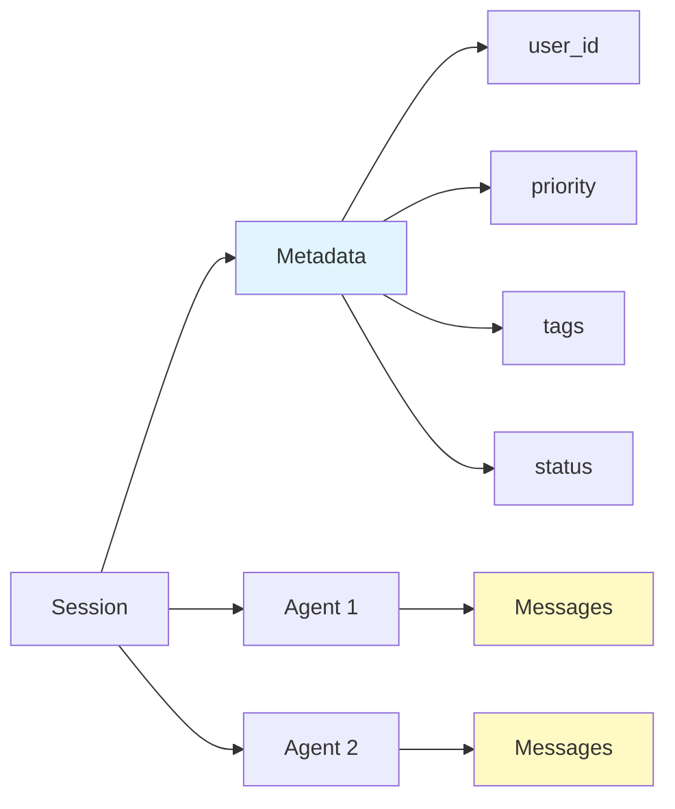

# Metadata Management User Guide

## Overview

Metadata management allows you to store and manage custom session-level data that isn't part of the conversation history. This guide covers metadata operations, partial updates, the metadata tool for agents, hooks for customization, and practical use cases.

## Table of Contents

1. [What is Metadata?](#what-is-metadata)
2. [Metadata Operations](#metadata-operations)
3. [Partial Updates](#partial-updates)
4. [Metadata Tool for Agents](#metadata-tool-for-agents)
5. [Metadata Hooks](#metadata-hooks)
6. [Use Cases and Patterns](#use-cases-and-patterns)
7. [Best Practices](#best-practices)
8. [Advanced Topics](#advanced-topics)

## What is Metadata?

**Metadata** is session-level data that provides context, state, or configuration for your AI agents. Unlike conversation messages, metadata is:

- **Session-scoped**: Shared across all agents in a session
- **Flexible**: Store any JSON-serializable data
- **Queryable**: Can be indexed for efficient queries
- **Mutable**: Can be updated, deleted, or retrieved at any time

### Metadata vs Conversation History



### MongoDB Schema

```json
{
    "_id": "session-id",
    "session_id": "session-id",
    "metadata": {
        "user_id": "alice-123",
        "priority": "high",
        "department": "sales",
        "tags": ["important", "customer"],
        "status": "active",
        "custom_field": "value"
    },
    "agents": {...},
    "feedbacks": [...]
}
```

### Common Metadata Fields

- **User Information**: user_id, user_name, user_email
- **Session Context**: topic, category, department, language
- **Priority/Status**: priority, status, urgency, severity
- **Tags/Labels**: tags, labels, categories
- **Timestamps**: started_at, last_activity, expires_at
- **Custom Data**: Any domain-specific information

## Metadata Operations

The session manager provides three core metadata operations:

### 1. Update Metadata

Add or update metadata fields:

```python
from mongodb_session_manager import create_mongodb_session_manager

session_manager = create_mongodb_session_manager(
    session_id="user-123",
    connection_string="mongodb://localhost:27017/",
    database_name="chat_db"
)

# Update metadata
session_manager.update_metadata({
    "user_id": "alice-123",
    "priority": "high",
    "department": "sales"
})

# Add more fields
session_manager.update_metadata({
    "tags": ["important", "customer"],
    "status": "active"
})
```

### 2. Get Metadata

Retrieve all metadata for a session:

```python
# Get all metadata
metadata = session_manager.get_metadata()

print(metadata)
# Output:
# {
#     "metadata": {
#         "user_id": "alice-123",
#         "priority": "high",
#         "department": "sales",
#         "tags": ["important", "customer"],
#         "status": "active"
#     }
# }

# Access specific fields
user_id = metadata.get("metadata", {}).get("user_id")
priority = metadata.get("metadata", {}).get("priority")
```

### 3. Delete Metadata

Remove specific metadata fields:

```python
# Delete sensitive fields before archival
session_manager.delete_metadata(["user_email", "phone_number"])

# Delete temporary fields
session_manager.delete_metadata(["temp_status", "processing_flag"])

# Multiple deletions
session_manager.delete_metadata([
    "internal_notes",
    "debug_info",
    "temporary_data"
])
```

## Partial Updates

One of the most powerful features is **partial updates** - updating specific fields without affecting others.

### How It Works

```python
# Initial metadata
session_manager.update_metadata({
    "user_id": "alice-123",
    "priority": "normal",
    "department": "sales",
    "created_at": "2024-01-15T10:00:00Z"
})

# Update only priority (other fields preserved!)
session_manager.update_metadata({
    "priority": "high"
})

# Get metadata - all fields still present
metadata = session_manager.get_metadata()
print(metadata.get("metadata"))
# Output:
# {
#     "user_id": "alice-123",      # Preserved!
#     "priority": "high",           # Updated!
#     "department": "sales",        # Preserved!
#     "created_at": "2024-01-15..." # Preserved!
# }
```

### MongoDB Implementation

Internally, partial updates use MongoDB's `$set` operator with dot notation:

```python
# This update:
session_manager.update_metadata({"priority": "high", "status": "active"})

# Becomes this MongoDB operation:
collection.update_one(
    {"_id": "session-id"},
    {"$set": {
        "metadata.priority": "high",
        "metadata.status": "active"
    }}
)
# Other fields in metadata remain unchanged!
```

### Progressive Metadata Building

```python
# Step 1: Initial metadata
session_manager.update_metadata({
    "session_type": "support"
})

# Step 2: Add user info when identified
session_manager.update_metadata({
    "user_id": "alice-123",
    "user_name": "Alice"
})

# Step 3: Add priority when assessed
session_manager.update_metadata({
    "priority": "high",
    "urgency": "critical"
})

# Step 4: Add resolution info when closed
session_manager.update_metadata({
    "status": "resolved",
    "resolved_at": datetime.now().isoformat()
})

# All metadata accumulated progressively!
```

## Metadata Tool for Agents

Agents can autonomously manage session metadata using the built-in metadata tool.

### Getting the Tool

```python
from mongodb_session_manager import create_mongodb_session_manager
from strands import Agent

session_manager = create_mongodb_session_manager(
    session_id="user-123",
    connection_string="mongodb://localhost:27017/",
    database_name="chat_db"
)

# Get the metadata tool
metadata_tool = session_manager.get_metadata_tool()

# Create agent with metadata capabilities
agent = Agent(
    model="claude-3-sonnet",
    agent_id="assistant",
    session_manager=session_manager,
    tools=[metadata_tool],  # Agent can now manage metadata!
    system_prompt="You are a helpful assistant with metadata access."
)
```

### Tool Operations

The metadata tool supports four actions:

```python
# 1. GET - Retrieve all metadata
result = metadata_tool(action="get")
# Returns: "All metadata: {\"user_id\": \"alice-123\", ...}"

# 2. GET with specific keys
result = metadata_tool(action="get", keys=["user_id", "priority"])
# Returns: "Metadata retrieved: {\"user_id\": \"alice-123\", \"priority\": \"high\"}"

# 3. SET/UPDATE - Add or update metadata
result = metadata_tool(
    action="set",
    metadata={"priority": "high", "status": "active"}
)
# Returns: "Successfully updated metadata fields: ['priority', 'status']"

# 4. DELETE - Remove metadata fields
result = metadata_tool(action="delete", keys=["temp_field"])
# Returns: "Successfully deleted metadata fields: ['temp_field']"
```

### Agent Usage Example

```python
from mongodb_session_manager import create_mongodb_session_manager
from strands import Agent

# Create session with metadata tool
session_manager = create_mongodb_session_manager(
    session_id="customer-support",
    connection_string="mongodb://localhost:27017/",
    database_name="support_db"
)

metadata_tool = session_manager.get_metadata_tool()

agent = Agent(
    model="claude-3-sonnet",
    agent_id="support-agent",
    session_manager=session_manager,
    tools=[metadata_tool],
    system_prompt="""
    You are a support agent. When you learn information about the customer,
    use the manage_metadata tool to store it. When someone asks what you know
    about the customer, retrieve it using the tool.
    """
)

# Agent autonomously manages metadata
response = agent(
    "Hi! My name is Alice and I'm calling about my enterprise account. "
    "This is urgent and related to billing."
)
# Agent will use metadata_tool to store:
# - customer_name: Alice
# - account_type: enterprise
# - priority: urgent
# - category: billing

# Later in conversation
response = agent("What do you know about this customer?")
# Agent will use metadata_tool(action="get") to retrieve stored information
```

### Tool Schema

The metadata tool is defined with this JSON schema:

```json
{
    "name": "manage_metadata",
    "description": "Manage session metadata with get, set/update, or delete operations.",
    "inputSchema": {
        "type": "object",
        "properties": {
            "action": {
                "type": "string",
                "description": "The action to perform: 'get', 'set', 'update', or 'delete'"
            },
            "metadata": {
                "type": "object",
                "description": "For set/update: dictionary of key-value pairs"
            },
            "keys": {
                "type": "array",
                "description": "For get: specific keys to retrieve. For delete: keys to remove"
            }
        },
        "required": ["action"]
    }
}
```

## Metadata Hooks

Hooks allow you to intercept and customize metadata operations with custom logic.

### Hook Interface

```python
def metadata_hook(original_func, action, session_id, **kwargs):
    """
    Hook function that intercepts metadata operations.

    Args:
        original_func: The original method (update_metadata, get_metadata, or delete_metadata)
        action: The action being performed ("update", "get", "delete")
        session_id: ID of the session
        **kwargs: Additional arguments:
            - metadata: Dict for update operations
            - keys: List for delete operations

    Returns:
        Result from original function (or modified result)
    """
    # Your custom logic here

    # Call original function
    if action == "update":
        return original_func(kwargs["metadata"])
    elif action == "delete":
        return original_func(kwargs["keys"])
    else:  # get
        return original_func()
```

### Example 1: Audit Hook

Log all metadata operations for compliance:

```python
import logging
import json

logger = logging.getLogger(__name__)

def metadata_audit_hook(original_func, action, session_id, **kwargs):
    """Audit all metadata operations."""
    logger.info(f"[METADATA AUDIT] {action} on session {session_id}")

    if action == "update":
        logger.info(f"[METADATA AUDIT] Data: {json.dumps(kwargs['metadata'])}")
        return original_func(kwargs["metadata"])
    elif action == "delete":
        logger.info(f"[METADATA AUDIT] Deleting keys: {kwargs['keys']}")
        return original_func(kwargs["keys"])
    else:  # get
        result = original_func()
        logger.info(f"[METADATA AUDIT] Retrieved metadata")
        return result

# Use the hook
from mongodb_session_manager import MongoDBSessionManager

session_manager = MongoDBSessionManager(
    session_id="audited-session",
    connection_string="mongodb://localhost:27017/",
    database_name="my_db",
    metadataHook=metadata_audit_hook  # All operations logged
)

# All metadata operations will be audited
session_manager.update_metadata({"status": "active"})  # Logged!
metadata = session_manager.get_metadata()              # Logged!
session_manager.delete_metadata(["temp_field"])        # Logged!
```

### Example 2: Validation Hook

Validate metadata before saving:

```python
from datetime import datetime

def metadata_validation_hook(original_func, action, session_id, **kwargs):
    """Validate metadata before operations."""
    PROTECTED_FIELDS = ["_id", "session_id", "created_at"]
    REQUIRED_FIELDS = ["last_updated", "updated_by"]

    if action == "update":
        metadata = kwargs["metadata"]

        # Check protected fields
        for field in PROTECTED_FIELDS:
            if field in metadata:
                raise ValueError(f"Cannot update protected field: {field}")

        # Auto-add required fields
        for field in REQUIRED_FIELDS:
            if field not in metadata:
                metadata[field] = "system" if field == "updated_by" else datetime.now().isoformat()

        # Add validation timestamp
        metadata["_validated_at"] = datetime.now().isoformat()

        return original_func(metadata)

    elif action == "delete":
        # Prevent deletion of protected fields
        protected = [key for key in kwargs["keys"] if key in PROTECTED_FIELDS]
        if protected:
            raise ValueError(f"Cannot delete protected fields: {protected}")
        return original_func(kwargs["keys"])

    else:  # get
        return original_func()

# Use the hook
session_manager = MongoDBSessionManager(
    session_id="validated-session",
    connection_string="mongodb://localhost:27017/",
    database_name="my_db",
    metadataHook=metadata_validation_hook
)

# Validation happens automatically
session_manager.update_metadata({"user_name": "Alice"})
# Auto-adds: last_updated, updated_by, _validated_at

# This will fail
try:
    session_manager.update_metadata({"_id": "cannot-change"})
except ValueError as e:
    print(f"Validation error: {e}")
```

### Example 3: Caching Hook

Implement read caching for better performance:

```python
import time

class MetadataCacheHook:
    """Hook that caches metadata reads."""

    def __init__(self, ttl_seconds=60):
        self.cache = {}
        self.ttl_seconds = ttl_seconds

    def __call__(self, original_func, action, session_id, **kwargs):
        if action == "get":
            # Check cache
            cache_key = f"{session_id}:metadata"
            if cache_key in self.cache:
                cached_data, timestamp = self.cache[cache_key]
                if time.time() - timestamp < self.ttl_seconds:
                    print(f"[CACHE] Hit for {session_id}")
                    return cached_data

            # Cache miss
            print(f"[CACHE] Miss for {session_id}")
            result = original_func()
            self.cache[cache_key] = (result, time.time())
            return result

        elif action in ["update", "delete"]:
            # Invalidate cache on writes
            cache_key = f"{session_id}:metadata"
            if cache_key in self.cache:
                del self.cache[cache_key]
                print(f"[CACHE] Invalidated for {session_id}")

            if action == "update":
                return original_func(kwargs["metadata"])
            else:  # delete
                return original_func(kwargs["keys"])

# Use the cache hook
cache_hook = MetadataCacheHook(ttl_seconds=30)
session_manager = MongoDBSessionManager(
    session_id="cached-session",
    connection_string="mongodb://localhost:27017/",
    database_name="my_db",
    metadataHook=cache_hook
)

# First get - cache miss
metadata1 = session_manager.get_metadata()  # Cache miss - queries MongoDB

# Second get - cache hit
metadata2 = session_manager.get_metadata()  # Cache hit - no MongoDB query!

# Update invalidates cache
session_manager.update_metadata({"status": "updated"})  # Cache invalidated

# Next get - cache miss
metadata3 = session_manager.get_metadata()  # Cache miss - queries MongoDB
```

### Example 4: Combined Hooks

Chain multiple hooks together:

```python
def create_combined_hook(*hooks):
    """Combine multiple hooks into one."""
    def combined_hook(original_func, action, session_id, **kwargs):
        # Apply hooks in order
        current_func = original_func

        for hook in reversed(hooks):
            def make_wrapper(h, f):
                def wrapper(*args, **kw):
                    if args:
                        return f(*args, **kw)
                    else:
                        return h(f, action, session_id, **kw)
                return wrapper
            current_func = make_wrapper(hook, current_func)

        # Execute
        if action == "update":
            return current_func(kwargs["metadata"])
        elif action == "delete":
            return current_func(kwargs["keys"])
        else:  # get
            return current_func()

    return combined_hook

# Combine audit and validation
combined = create_combined_hook(
    metadata_audit_hook,
    metadata_validation_hook
)

session_manager = MongoDBSessionManager(
    session_id="combined-session",
    connection_string="mongodb://localhost:27017/",
    database_name="my_db",
    metadataHook=combined  # Both hooks active!
)

# Operations are both audited AND validated
session_manager.update_metadata({"project": "demo"})
```

## Use Cases and Patterns

### Use Case 1: User Context Management

```python
# Store user information
session_manager.update_metadata({
    "user_id": "alice-123",
    "user_name": "Alice Johnson",
    "user_email": "alice@example.com",
    "subscription_tier": "premium",
    "preferred_language": "en"
})

# Update preferences progressively
session_manager.update_metadata({
    "theme": "dark",
    "notifications": True
})

# Remove sensitive data before archival
session_manager.delete_metadata(["user_email", "phone_number"])
```

### Use Case 2: Session State Tracking

```python
from datetime import datetime

# Initialize session
session_manager.update_metadata({
    "status": "initiated",
    "created_at": datetime.now().isoformat(),
    "interaction_count": 0
})

# Update as conversation progresses
session_manager.update_metadata({
    "status": "active",
    "last_activity": datetime.now().isoformat(),
    "interaction_count": 5
})

# Mark completion
session_manager.update_metadata({
    "status": "completed",
    "completed_at": datetime.now().isoformat(),
    "resolution": "satisfied"
})
```

### Use Case 3: Customer Support

```python
# Initial contact
session_manager.update_metadata({
    "customer_id": "CUST-12345",
    "issue_type": "billing",
    "priority": "normal",
    "assigned_to": None
})

# Escalate if needed
session_manager.update_metadata({
    "priority": "high",
    "escalated": True,
    "assigned_to": "supervisor-jane"
})

# Track resolution
session_manager.update_metadata({
    "status": "resolved",
    "resolution_time_minutes": 45,
    "customer_satisfaction": 5
})
```

### Use Case 4: Multi-Step Workflows

```python
# Workflow state machine
session_manager.update_metadata({
    "workflow": "order_processing",
    "current_step": "validate_order",
    "steps_completed": []
})

# Progress through workflow
def complete_step(step_name):
    metadata = session_manager.get_metadata()
    steps = metadata.get("metadata", {}).get("steps_completed", [])
    steps.append(step_name)

    session_manager.update_metadata({
        "steps_completed": steps,
        "current_step": get_next_step(step_name)
    })

complete_step("validate_order")
complete_step("process_payment")
complete_step("ship_order")
```

### Use Case 5: A/B Testing

```python
import random

# Assign experiment variant
variant = "A" if random.random() < 0.5 else "B"
session_manager.update_metadata({
    "experiment": "new_prompt_test",
    "variant": variant,
    "experiment_started": datetime.now().isoformat()
})

# Track metrics
session_manager.update_metadata({
    "messages_sent": 10,
    "average_response_time": 1.2,
    "user_satisfaction": 4.5
})
```

## Best Practices

### 1. Use Meaningful Field Names

```python
# Good - clear and descriptive
session_manager.update_metadata({
    "customer_tier": "premium",
    "issue_category": "technical",
    "escalation_level": 2
})

# Bad - unclear abbreviations
session_manager.update_metadata({
    "ct": "pm",
    "ic": "tech",
    "el": 2
})
```

### 2. Keep Metadata Flat

```python
# Good - flat structure
session_manager.update_metadata({
    "user_name": "Alice",
    "user_email": "alice@example.com",
    "user_tier": "premium"
})

# Acceptable - one level of nesting if needed
session_manager.update_metadata({
    "user": {
        "name": "Alice",
        "email": "alice@example.com",
        "tier": "premium"
    }
})

# Bad - deep nesting
session_manager.update_metadata({
    "data": {
        "user": {
            "profile": {
                "info": {
                    "name": "Alice"
                }
            }
        }
    }
})
```

### 3. Use Partial Updates

```python
# Good - only update what changed
session_manager.update_metadata({"status": "active"})

# Bad - replacing all metadata
metadata = session_manager.get_metadata()
metadata["metadata"]["status"] = "active"
session_manager.update_metadata(metadata["metadata"])
```

### 4. Index Important Fields

```python
# Specify fields to index at creation
from mongodb_session_manager import MongoDBSessionManager

session_manager = MongoDBSessionManager(
    session_id="user-123",
    connection_string="mongodb://localhost:27017/",
    database_name="my_db",
    metadata_fields=["user_id", "priority", "status"]  # Will be indexed!
)
```

### 5. Clean Up Sensitive Data

```python
# Before archiving or exporting
session_manager.delete_metadata([
    "user_email",
    "phone_number",
    "credit_card_last_4",
    "internal_notes"
])
```

### 6. Use Validation Hooks

```python
# Enforce data quality
def validate_metadata(original_func, action, session_id, **kwargs):
    if action == "update":
        metadata = kwargs["metadata"]

        # Validate priority values
        if "priority" in metadata:
            if metadata["priority"] not in ["low", "normal", "high", "critical"]:
                raise ValueError("Invalid priority value")

        # Validate email format
        if "email" in metadata:
            if "@" not in metadata["email"]:
                raise ValueError("Invalid email format")

        return original_func(metadata)
    # ... handle other actions
```

### 7. Document Your Metadata Schema

```python
# Document expected metadata fields
METADATA_SCHEMA = {
    "user_id": "string - unique user identifier",
    "priority": "enum - low|normal|high|critical",
    "status": "enum - active|pending|resolved|archived",
    "tags": "array - custom tags for categorization",
    "created_at": "ISO 8601 datetime",
    "updated_at": "ISO 8601 datetime"
}
```

## Advanced Topics

### Querying Metadata

```python
# Direct MongoDB queries on metadata
from mongodb_session_manager import MongoDBSessionRepository

repo = MongoDBSessionRepository(
    connection_string="mongodb://localhost:27017/",
    database_name="my_db",
    collection_name="sessions"
)

# Find sessions by metadata
high_priority_sessions = repo.collection.find({
    "metadata.priority": "high",
    "metadata.status": "active"
})

# Aggregate by metadata fields
pipeline = [
    {"$match": {"metadata.department": "sales"}},
    {"$group": {
        "_id": "$metadata.priority",
        "count": {"$sum": 1}
    }}
]
results = repo.collection.aggregate(pipeline)
```

### Metadata Versioning

```python
from datetime import datetime

def versioned_metadata_hook(original_func, action, session_id, **kwargs):
    """Add version tracking to metadata updates."""
    if action == "update":
        metadata = kwargs["metadata"]

        # Get current version
        current = original_func.__self__.get_metadata(session_id)
        version = current.get("metadata", {}).get("_version", 0)

        # Add version info
        metadata["_version"] = version + 1
        metadata["_updated_at"] = datetime.now().isoformat()

        return original_func(metadata)
    # ... handle other actions
```

### Synchronizing with External Systems

```python
def sync_to_crm_hook(original_func, action, session_id, **kwargs):
    """Sync metadata changes to external CRM."""
    result = None

    if action == "update":
        result = original_func(kwargs["metadata"])
        # Sync to external system
        crm_client.update_customer(
            session_id=session_id,
            data=kwargs["metadata"]
        )
    elif action == "delete":
        result = original_func(kwargs["keys"])
        # Remove from external system
        crm_client.delete_fields(
            session_id=session_id,
            fields=kwargs["keys"]
        )
    else:
        result = original_func()

    return result
```

## Next Steps

- **[Feedback System](feedback-system.md)**: Learn how to collect user feedback
- **[AWS Integrations](aws-integrations.md)**: Sync metadata to AWS services
- **[Session Management](session-management.md)**: Understand session lifecycle
- **[Examples](../examples/metadata-examples.md)**: Complete code examples

## Additional Resources

- [MongoDB Query Documentation](https://docs.mongodb.com/manual/tutorial/query-documents/)
- [JSON Schema Validation](https://json-schema.org/)
- [API Reference](../api-reference/session-manager.md)
