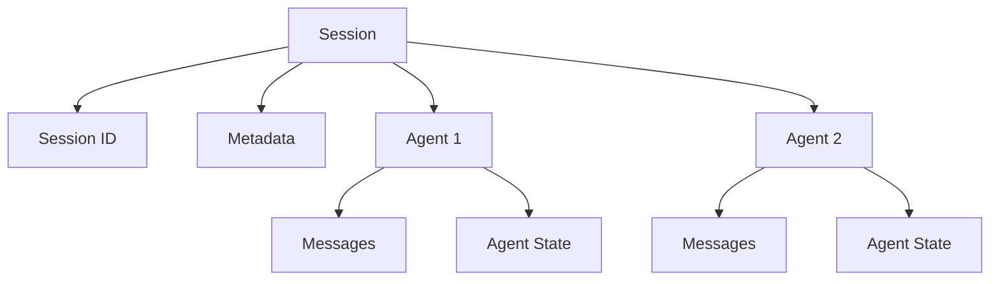
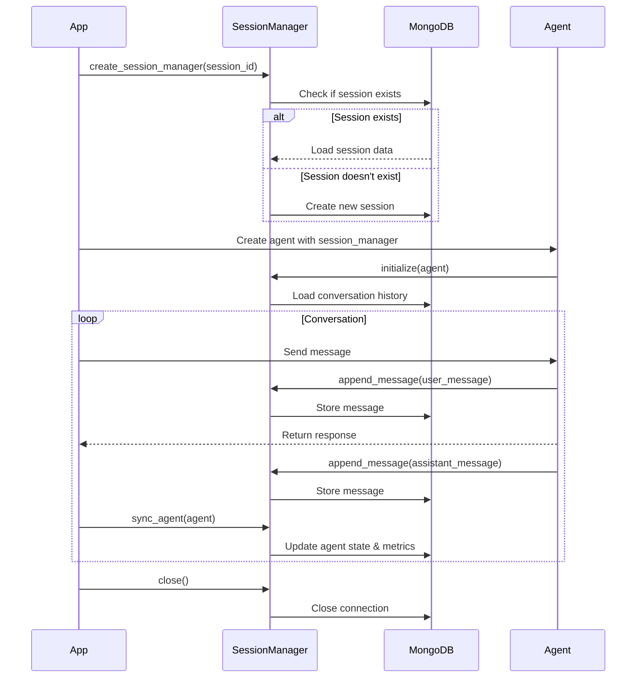

# Session Management User Guide

## Overview

The MongoDB Session Manager provides persistent storage for agent conversations and state in MongoDB. This guide covers everything you need to know about managing sessions, including lifecycle management, session persistence, resumption, and best practices.

## Table of Contents

1. [What is a Session?](#what-is-a-session)
2. [Session Lifecycle](#session-lifecycle)
3. [Creating Sessions](#creating-sessions)
4. [Session Persistence](#session-persistence)
5. [Session Resumption](#session-resumption)
6. [Multiple Agents per Session](#multiple-agents-per-session)
7. [Session IDs Best Practices](#session-ids-best-practices)
8. [Message Management](#message-management)
9. [Agent State Management](#agent-state-management)
10. [Error Handling](#error-handling)
11. [Common Patterns](#common-patterns)

## What is a Session?

A **session** represents a conversation context between users and AI agents. Each session:

- Has a unique identifier (session_id)
- Can contain one or more agents with separate conversation histories
- Persists all messages, agent state, and metadata to MongoDB
- Can be resumed across different requests or application restarts
- Maintains timestamps for auditing and analytics

### Session Structure



### MongoDB Document Schema

```json
{
    "_id": "session-id",
    "session_id": "session-id",
    "session_type": "default",
    "created_at": "2024-01-15T09:00:00Z",
    "updated_at": "2024-01-22T14:30:00Z",
    "agents": {
        "agent-id": {
            "agent_data": {
                "agent_id": "agent-id",
                "state": {"key": "value"},
                "conversation_manager_state": {},
                "created_at": "2024-01-15T09:00:00Z",
                "updated_at": "2024-01-22T14:30:00Z"
            },
            "messages": [
                {
                    "message_id": 1,
                    "role": "user",
                    "content": "Hello",
                    "created_at": "2024-01-15T09:00:00Z",
                    "event_loop_metrics": {
                        "accumulated_metrics": {"latencyMs": 250},
                        "accumulated_usage": {
                            "inputTokens": 10,
                            "outputTokens": 20,
                            "totalTokens": 30
                        }
                    }
                }
            ]
        }
    },
    "metadata": {"priority": "high"},
    "feedbacks": []
}
```

## Session Lifecycle

### 1. Initialization

When you create a session manager, it either:
- Creates a new session document in MongoDB (if it doesn't exist)
- Loads an existing session (if the session_id already exists)

```python
from mongodb_session_manager import create_mongodb_session_manager

# Create or load a session
session_manager = create_mongodb_session_manager(
    session_id="user-123",
    connection_string="mongodb://localhost:27017/",
    database_name="chat_db",
    collection_name="sessions"
)
```

### 2. Active Use

During active use, the session:
- Stores messages as they're sent and received
- Captures agent state changes
- Records metrics (tokens, latency) automatically
- Updates timestamps

```python
from strands import Agent

# Create agent with session
agent = Agent(
    model="claude-3-sonnet",
    agent_id="assistant",
    session_manager=session_manager
)

# Use the agent - everything is persisted automatically
response = agent("Hello, how are you?")

# Sync to save state and metrics
session_manager.sync_agent(agent)
```

### 3. Termination

When done with a session, close the connection:

```python
# Clean up resources
session_manager.close()
```

### Lifecycle Diagram



## Creating Sessions

### Basic Session Creation

```python
from mongodb_session_manager import create_mongodb_session_manager

session_manager = create_mongodb_session_manager(
    session_id="customer-12345",
    connection_string="mongodb://localhost:27017/",
    database_name="my_database",
    collection_name="sessions"
)
```

### With MongoDB Options

```python
session_manager = create_mongodb_session_manager(
    session_id="customer-12345",
    connection_string="mongodb://localhost:27017/",
    database_name="my_database",
    collection_name="sessions",
    # MongoDB client options
    maxPoolSize=100,
    minPoolSize=10,
    serverSelectionTimeoutMS=5000,
    w="majority",
    journal=True
)
```

### Using MongoDBSessionManager Directly

```python
from mongodb_session_manager import MongoDBSessionManager

session_manager = MongoDBSessionManager(
    session_id="customer-12345",
    connection_string="mongodb://localhost:27017/",
    database_name="my_database",
    collection_name="sessions",
    metadata_fields=["priority", "category", "status"]
)
```

## Session Persistence

### How It Works

The session manager automatically persists:

1. **Messages**: Every user and assistant message
2. **Agent State**: Key-value pairs stored by the agent
3. **Metrics**: Token counts and latency from event loop
4. **Timestamps**: Creation and update times
5. **Metadata**: Custom session data

### Example: Complete Session

```python
from strands import Agent
from mongodb_session_manager import create_mongodb_session_manager

# Create session
session_manager = create_mongodb_session_manager(
    session_id="user-alice-chat",
    connection_string="mongodb://localhost:27017/",
    database_name="chat_db"
)

# Create agent
agent = Agent(
    model="claude-3-sonnet",
    agent_id="assistant",
    session_manager=session_manager,
    system_prompt="You are a helpful assistant."
)

# First message
response1 = agent("Hello! My name is Alice.")
session_manager.sync_agent(agent)

# Second message
response2 = agent("What's the weather like today?")
session_manager.sync_agent(agent)

# Add metadata
session_manager.update_metadata({
    "user_name": "Alice",
    "topic": "general",
    "priority": "normal"
})

# Clean up
session_manager.close()

# All conversation data is now persisted in MongoDB!
```

### Automatic Metrics Capture

The session manager automatically captures metrics during `sync_agent()`:

```python
# Use the agent
response = agent("Hello")

# Sync captures metrics from agent.event_loop_metrics
session_manager.sync_agent(agent)

# Metrics stored in MongoDB:
# - latencyMs: Response latency
# - inputTokens: Tokens in the request
# - outputTokens: Tokens in the response
# - totalTokens: Total tokens used
```

## Session Resumption

One of the most powerful features is the ability to resume conversations across different sessions or application restarts.

### Same-Day Resumption

```python
# Session 1 - Morning conversation
session_manager = create_mongodb_session_manager(
    session_id="user-alice-2024-01-15",
    connection_string="mongodb://localhost:27017/",
    database_name="chat_db"
)

agent = Agent(
    agent_id="assistant",
    model="claude-3-sonnet",
    session_manager=session_manager
)

response = agent("My name is Alice and I love programming.")
session_manager.sync_agent(agent)
session_manager.close()

# Session 2 - Afternoon conversation (same day)
session_manager = create_mongodb_session_manager(
    session_id="user-alice-2024-01-15",  # Same session ID!
    connection_string="mongodb://localhost:27017/",
    database_name="chat_db"
)

agent = Agent(
    agent_id="assistant",  # Same agent ID!
    model="claude-3-sonnet",
    session_manager=session_manager
)

# Agent has full conversation history
response = agent("What did I say I love?")
# Agent will remember "programming"
```

### Cross-Day Resumption

```python
# Day 1
session_manager = create_mongodb_session_manager(
    session_id="user-alice-project-x",
    connection_string="mongodb://localhost:27017/",
    database_name="chat_db"
)

agent = Agent(
    agent_id="project-assistant",
    model="claude-3-sonnet",
    session_manager=session_manager
)

response = agent("I'm working on a Python web app using FastAPI.")
session_manager.sync_agent(agent)
session_manager.close()

# Day 7 - Resume work
session_manager = create_mongodb_session_manager(
    session_id="user-alice-project-x",  # Same session ID
    connection_string="mongodb://localhost:27017/",
    database_name="chat_db"
)

agent = Agent(
    agent_id="project-assistant",  # Same agent ID
    model="claude-3-sonnet",
    session_manager=session_manager
)

# Full context available
response = agent("What technology stack did I mention for my web app?")
# Agent remembers "Python web app using FastAPI"
```

### Key Points for Resumption

1. **Same session_id**: Must use the identical session ID
2. **Same agent_id**: Agent ID must match to access the same conversation
3. **Automatic Loading**: The session manager automatically loads conversation history
4. **No Manual Setup**: Just create the agent and it has full context

## Multiple Agents per Session

A single session can support multiple specialized agents, each with their own conversation history and state.

### Why Multiple Agents?

- **Specialized Expertise**: Different agents for different tasks
- **Workflow Orchestration**: Hand off between agents
- **Role Separation**: Distinct conversational contexts
- **Shared Session Metadata**: All agents access the same session metadata

### Example: Support System

```python
from mongodb_session_manager import create_mongodb_session_manager
from strands import Agent

# One session for the customer interaction
session_manager = create_mongodb_session_manager(
    session_id=f"customer-{customer_id}-support",
    connection_string="mongodb://localhost:27017/",
    database_name="support_db"
)

# Translation agent
translator = Agent(
    model="claude-3-sonnet",
    agent_id="translator",
    session_manager=session_manager,
    system_prompt="You are a translation specialist for Basque-Spanish."
)

# Technical support agent
tech_support = Agent(
    model="claude-3-haiku",
    agent_id="tech-support",
    session_manager=session_manager,
    system_prompt="You provide technical support for API configuration."
)

# Customer service agent
customer_service = Agent(
    model="claude-3-sonnet",
    agent_id="customer-service",
    session_manager=session_manager,
    system_prompt="You are a friendly customer service representative."
)

# Use different agents for different tasks
translation = translator("Translate: 'Kaixo mundua'")
session_manager.sync_agent(translator)

support_response = tech_support("How do I configure API keys?")
session_manager.sync_agent(tech_support)

service_response = customer_service("I need help with my account.")
session_manager.sync_agent(customer_service)

# Each agent has separate conversation history but shares session metadata
session_manager.close()
```

### Accessing Different Agent Histories

Each agent maintains its own message history:

```python
# Create session with two agents
session_manager = create_mongodb_session_manager(
    session_id="demo-session",
    connection_string="mongodb://localhost:27017/",
    database_name="demo_db"
)

# Agent 1
agent1 = Agent(agent_id="agent-1", model="claude-3-sonnet", session_manager=session_manager)
agent1("Hello from agent 1")
session_manager.sync_agent(agent1)

# Agent 2
agent2 = Agent(agent_id="agent-2", model="claude-3-haiku", session_manager=session_manager)
agent2("Hello from agent 2")
session_manager.sync_agent(agent2)

# Each agent only sees their own conversation
# Agent 1 doesn't see "Hello from agent 2"
# Agent 2 doesn't see "Hello from agent 1"
```

## Session IDs Best Practices

### Naming Conventions

Choose session IDs that are:
- **Unique**: Prevent collisions
- **Meaningful**: Easy to identify
- **Consistent**: Follow a pattern

### Recommended Patterns

#### User-Based Sessions

```python
# Long-term user session
session_id = f"user-{user_id}-main"

# Monthly user sessions
session_id = f"user-{user_id}-{year}-{month}"

# Daily user sessions
session_id = f"user-{user_id}-{date}"
```

#### Purpose-Based Sessions

```python
# Customer support
session_id = f"customer-{customer_id}-support-{date}"

# Translation tasks
session_id = f"user-{user_id}-translation-{thread_id}"

# Project work
session_id = f"project-{project_id}-chat-{user_id}"
```

#### Event-Based Sessions

```python
# Web chat sessions
session_id = f"webchat-{uuid4()}"

# API request sessions
session_id = f"api-{request_id}"

# Workflow sessions
session_id = f"workflow-{workflow_id}-step-{step_number}"
```

### Anti-Patterns

Avoid these patterns:

```python
# Too generic - will collide
session_id = "session"
session_id = "user-session"

# No separation - hard to manage
session_id = f"{user_id}"

# Random only - hard to debug
session_id = str(uuid4())

# Using sensitive data
session_id = f"user-{email}"  # Don't use PII in IDs
```

## Message Management

### Appending Messages

Messages are automatically appended when using the agent, but you can also do it manually:

```python
# Automatic (recommended)
response = agent("Hello")
session_manager.sync_agent(agent)

# Manual message appending
from strands.types.content import Message

user_message = Message(role="user", content="Hello")
session_manager.append_message(user_message, agent)

assistant_message = Message(role="assistant", content="Hi there!")
session_manager.append_message(assistant_message, agent)
```

### Message Structure

Each message contains:

```python
{
    "message_id": 1,               # Auto-incrementing ID
    "role": "user",                # "user" or "assistant"
    "content": "Hello",            # Message content
    "created_at": "2024-01-15...", # Timestamp
    "updated_at": "2024-01-15...", # Timestamp
    "event_loop_metrics": {        # Only for assistant messages
        "accumulated_metrics": {
            "latencyMs": 250
        },
        "accumulated_usage": {
            "inputTokens": 10,
            "outputTokens": 20,
            "totalTokens": 30
        }
    }
}
```

### Redacting Messages

Sometimes you need to redact or modify messages:

```python
from strands.types.content import Message

# Create redacted message
redacted_message = Message(
    role="user",
    content="[REDACTED FOR PRIVACY]"
)

# Redact the latest message
session_manager.redact_latest_message(redacted_message, agent)
```

## Agent State Management

Agents can store stateful information that persists across sessions.

### Setting State

```python
# In your agent or tools
agent.state.set("user_language", "euskera")
agent.state.set("translation_count", 42)
agent.state.set("preferences", {
    "tone": "formal",
    "dialect": "bizkaiera"
})

# State is automatically saved to MongoDB during sync
session_manager.sync_agent(agent)
```

### Retrieving State

```python
# View current state
print(agent.state.to_dict())
# Output: {'user_language': 'euskera', 'translation_count': 42, ...}

# Get specific values
language = agent.state.get("user_language")
count = agent.state.get("translation_count")
```

### State Persistence

Agent state is automatically:
- Saved to MongoDB in `agent_data.state`
- Restored when the session is resumed
- Maintained across application restarts

```python
# Session 1: Set state
session_manager = create_mongodb_session_manager(session_id="user-123", ...)
agent = Agent(agent_id="assistant", session_manager=session_manager, ...)
agent.state.set("preference", "dark_mode")
session_manager.sync_agent(agent)
session_manager.close()

# Session 2: State is restored
session_manager = create_mongodb_session_manager(session_id="user-123", ...)
agent = Agent(agent_id="assistant", session_manager=session_manager, ...)
print(agent.state.get("preference"))  # Output: "dark_mode"
```

## Error Handling

### Connection Errors

```python
from pymongo.errors import PyMongoError

try:
    session_manager = create_mongodb_session_manager(
        session_id="user-123",
        connection_string="mongodb://localhost:27017/",
        database_name="chat_db"
    )

    agent = Agent(session_manager=session_manager, ...)
    response = agent("Hello")

except PyMongoError as e:
    logger.error(f"MongoDB error: {e}")
    # Fallback behavior - maybe use in-memory session

except Exception as e:
    logger.error(f"Session error: {e}")
    # General error handling

finally:
    if session_manager:
        session_manager.close()
```

### Session Not Found

```python
# Sessions are created automatically if they don't exist
# But you can check first
from mongodb_session_manager import MongoDBSessionRepository

repo = MongoDBSessionRepository(
    connection_string="mongodb://localhost:27017/",
    database_name="chat_db",
    collection_name="sessions"
)

session = repo.read_session("user-123")
if session is None:
    print("Session doesn't exist - will be created")
else:
    print("Session exists - will be loaded")
```

### Resource Cleanup

Always close sessions properly:

```python
# Using context manager (recommended)
class SessionContext:
    def __init__(self, session_id, **kwargs):
        self.session_id = session_id
        self.kwargs = kwargs
        self.session_manager = None

    def __enter__(self):
        self.session_manager = create_mongodb_session_manager(
            session_id=self.session_id,
            **self.kwargs
        )
        return self.session_manager

    def __exit__(self, exc_type, exc_val, exc_tb):
        if self.session_manager:
            self.session_manager.close()

# Usage
with SessionContext(session_id="user-123", connection_string="...") as session_manager:
    agent = Agent(session_manager=session_manager, ...)
    response = agent("Hello")
# Automatically closed!
```

## Common Patterns

### Pattern 1: Simple Chat Application

```python
from mongodb_session_manager import create_mongodb_session_manager
from strands import Agent

def chat_session(user_id: str):
    """Create a persistent chat session for a user."""
    session_manager = create_mongodb_session_manager(
        session_id=f"user-{user_id}-chat",
        connection_string="mongodb://localhost:27017/",
        database_name="chat_app"
    )

    agent = Agent(
        agent_id="chatbot",
        model="claude-3-sonnet",
        session_manager=session_manager
    )

    return session_manager, agent

# Use it
session_manager, agent = chat_session("alice")
response = agent("Hello!")
session_manager.sync_agent(agent)
session_manager.close()
```

### Pattern 2: Customer Support with Context

```python
def create_support_session(customer_id: str, issue_type: str):
    """Create a support session with metadata."""
    session_id = f"support-{customer_id}-{issue_type}-{datetime.now().isoformat()}"

    session_manager = create_mongodb_session_manager(
        session_id=session_id,
        connection_string="mongodb://localhost:27017/",
        database_name="support_db"
    )

    # Add metadata
    session_manager.update_metadata({
        "customer_id": customer_id,
        "issue_type": issue_type,
        "priority": "normal",
        "created_at": datetime.now().isoformat()
    })

    agent = Agent(
        agent_id="support-agent",
        model="claude-3-sonnet",
        session_manager=session_manager,
        system_prompt=f"You are a support agent helping with {issue_type} issues."
    )

    return session_manager, agent
```

### Pattern 3: Long-Running Workflows

```python
class WorkflowSession:
    """Manage a multi-step workflow with session persistence."""

    def __init__(self, workflow_id: str):
        self.workflow_id = workflow_id
        self.session_manager = create_mongodb_session_manager(
            session_id=f"workflow-{workflow_id}",
            connection_string="mongodb://localhost:27017/",
            database_name="workflows"
        )

        self.orchestrator = Agent(
            agent_id="orchestrator",
            model="claude-3-sonnet",
            session_manager=self.session_manager
        )

    def execute_step(self, step_name: str, input_data: str):
        """Execute a workflow step."""
        # Update metadata with current step
        self.session_manager.update_metadata({
            "current_step": step_name,
            "last_update": datetime.now().isoformat()
        })

        # Execute with agent
        response = self.orchestrator(
            f"Execute step '{step_name}' with input: {input_data}"
        )

        self.session_manager.sync_agent(self.orchestrator)
        return response

    def close(self):
        """Clean up resources."""
        self.session_manager.close()

# Usage
workflow = WorkflowSession("order-processing-123")
workflow.execute_step("validate_order", "order_data")
workflow.execute_step("process_payment", "payment_info")
workflow.execute_step("ship_order", "shipping_address")
workflow.close()
```

## Next Steps

Now that you understand session management, explore these related guides:

- **[Connection Pooling](connection-pooling.md)**: Optimize performance with connection reuse
- **[Factory Pattern](factory-pattern.md)**: Efficient session manager creation for stateless environments
- **[Metadata Management](metadata-management.md)**: Advanced metadata operations and hooks
- **[Feedback System](feedback-system.md)**: Collect and manage user feedback
- **[AWS Integrations](aws-integrations.md)**: Real-time notifications and event propagation
- **[Async Streaming](async-streaming.md)**: Stream responses in real-time

## Additional Resources

- [API Reference](../api-reference/README.md): Detailed API documentation
- [Architecture Guide](../architecture/README.md): System design and internals
- [Examples](../examples/README.md): Complete code examples
